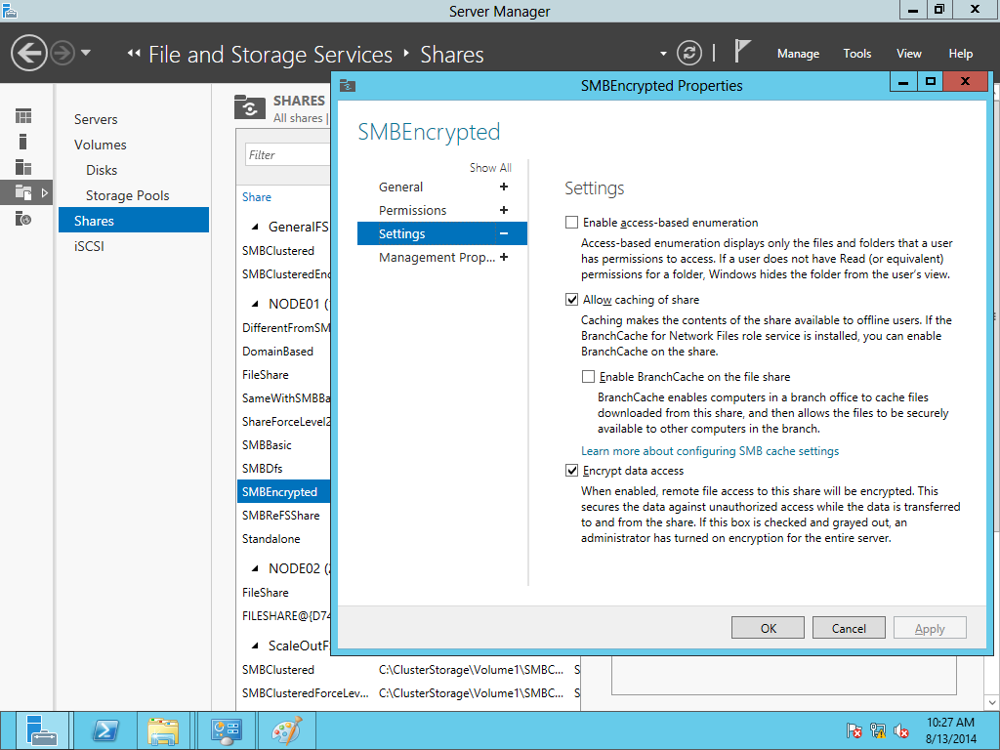
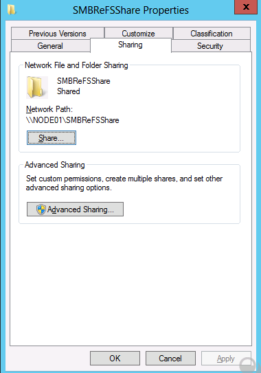
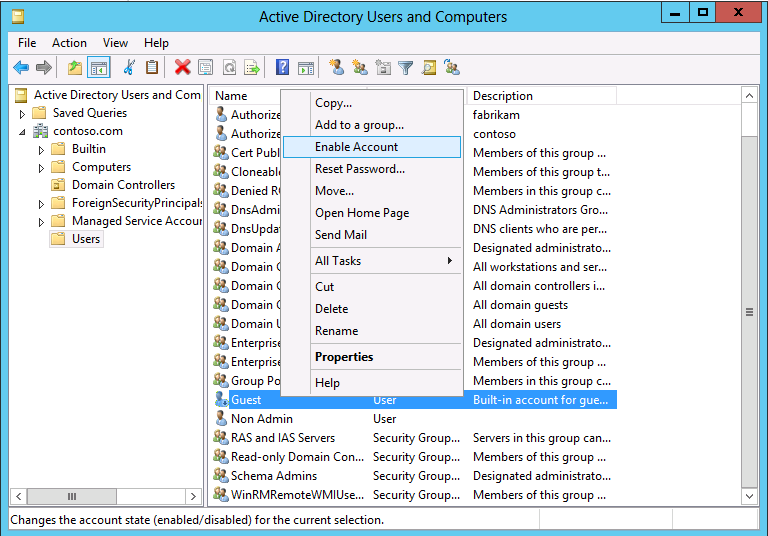
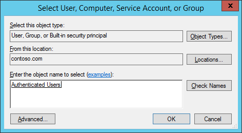
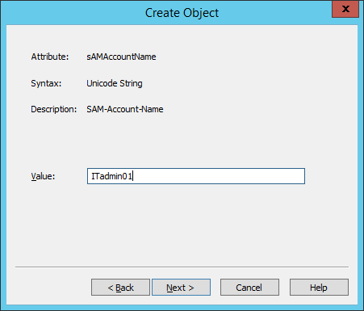
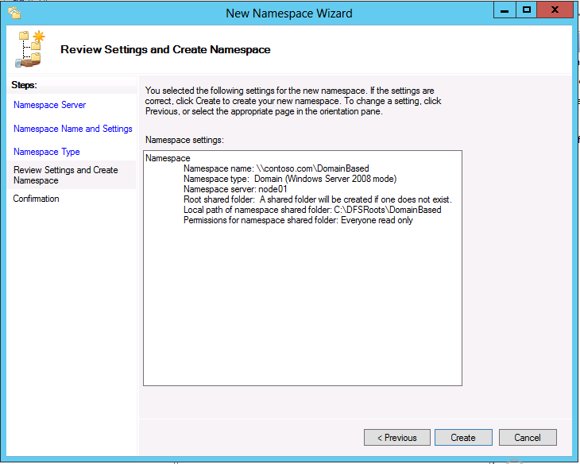
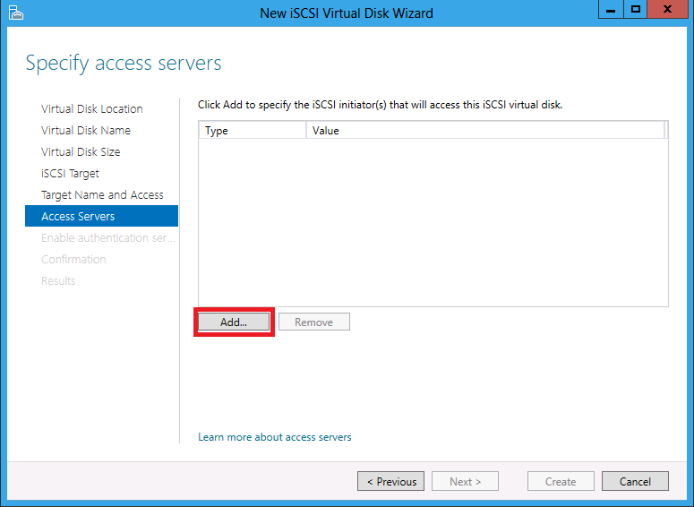
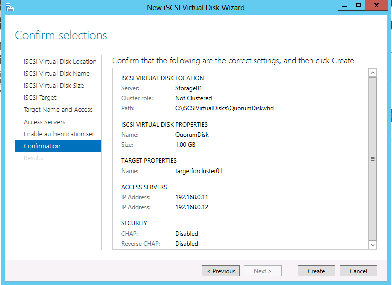
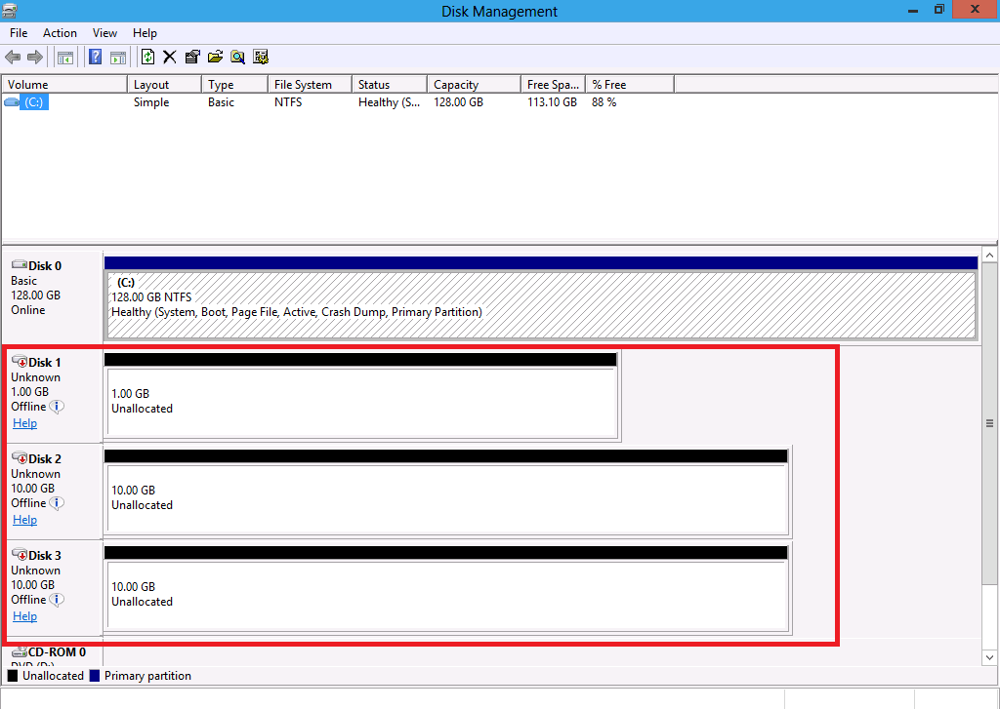
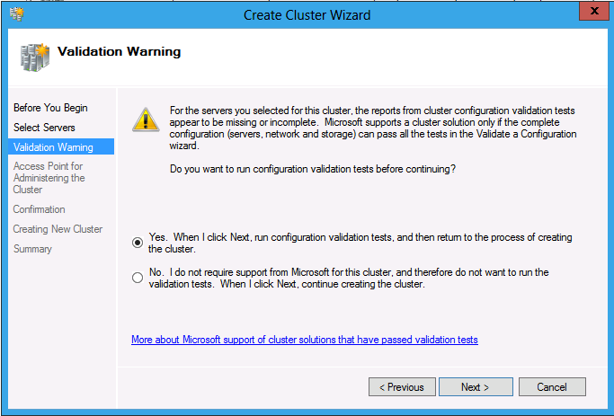

| File Sharing Protocol Family                             
                                                           
 Server Test Suite User Guide                              |
|----------------------------------------------------------|
| *Windows is built to be the most interoperable platform* |
|                                   |

Introduction
========================================================================================================================================================================================================

This guide provides information about how to install, configure, and run File Sharing Test Suite in its environment. This suite is designed to test implementations of file sharing protocol family of protocols including Server Message Block (SMB) Protocol Version 2 and 3, File Server Remote VSS Protocol and Service Witness Protocol, The Distributed File System (DFS): Namespace Referral Protocol, Remote Shared Virtual Disk Protocol, as specified in the Microsoft document *\[MS-SMB2\], \[MS-FSRVP\] , \[MS-SWN\], \[MS-DFSC\], \[MS-FSA\], \[MS-SQOS\] and \[MS-RSVD\].* This guide provides information about using this test suite on the Microsoft® Windows® operating system and on operating systems that are not Windows based.

This suite tests only the protocol implementation behaviors that are observed on the wire. For detailed information about the design of this test suite, please see *FileSharing\_ServerTestDesignSpecification.docx*.

License Information
=================================================================================================================

For licensing information, please see the End User License Agreement (EULA) that is provided with this test suite. The EULA is contained in the EULA.rtf file in the installation folder.

Further Assistance
================================================================================================================

If you need further information about this test suite or assistance in troubleshooting issues related to this test suite, contact <dochelp@microsoft.com>.

Quick Start Checklist
==================================================================================================================================================================

The following checklist summarizes the steps you need to complete to get the test suite up and running. The checklist also provides references to documentation that can help you get started.

Note

For workgroup environments, omit tasks that are related to the setup and configuration of domain controllers.

| **Check** | **Task**                                                                                 | **Topic**                                                                                                                                                                                                         |
|-----------|------------------------------------------------------------------------------------------|-------------------------------------------------------------------------------------------------------------------------------------------------------------------------------------------------------------------|
| □         | Download the test suite for the protocol implementation                                  | For a list of the files that the download package contains, please see section [8](#_Installed_Files_and_1).                                                                                                      |
| □         | Confirm that your test environment and computers meet the requirements of the test suite | For information about the requirements of the test suite, please see section [5](#_Requirements).                                                                                                                 |
| □         | Set up the Domain Controller (DC)                                                        | See section [7.2.1](#_Setup_the_Domain_1).                                                                                                                                              |
| □         | Set up the system under test (SUT)                                                       | See section [7.1.2](#_Setup_the_SUT) or section [7.2.3](#_Setup_the_SUT_1) .                                                                                                                                      |
| □         | Set up the driver computer                                                               | See section [7.1.1](#_Setup_the_Driver_1) or section [7.2.2](#_Setup_the_Driver_2).                                                                                                                               |
| □         | Set up the network                                                                       | See section [6](#_Network_Setup_1).                                                                                                                                                                               |
| □         | Verify the connections from the driver computer to the SUT and other computers           | See section [6.3](#_Verify_Connectivity_from_1).                                                                                                                                                                  |
| □         | Install the software prerequisites                                                       | For information about software that must be installed on the computers in your test environment before the test suite is installed, please see section [5.7](#_Software_2). |
| □         | Configure the test suite settings                                                        | See section [9.1](#_Network_Configuration_2).                                                                                                                                                                     |
| □         | Run a BVT test                                                                           | Section [9.3.1](#_Run_Scenario0_Test)                                                                                                                                                                             |
| □         | Run test cases                                                                           | Section [9.3.2](#_Run_All_Test)                                                                                                                                                                                   |
| □         | Debug my own test cases                                                                  | Section [10](#_Debugging_Test_Cases)                                                                                                                                                                              |
| □         | Get the results of test runs                                                             | Section [9.3.3](#_Run_Specified_Test)                                                                                                                                                                             |

Requirements 
=================================================================================================================================================================================================================================================================

This section lists the requirements for the test environment used to run this test suite.

Network Infrastructure
----------------------

-   A test network is required to connect the test computer systems.

-   It must consist of an isolated hub or switch.

-   It must not be connected to a production network or used for any other business or personal communications or operations.

-   It must not be connected to the internet.

-   IP addresses must be assigned for the test network.

-   Computer names should be assigned in the test network infrastructure.

-   User credentials used on the system must be dedicated to the test network infrastructure.

-   Network details including computer IP addresses, names and credentials will be saved in log files.

    -   Please refer to the Detailed Logging Support section.

> Please refer to the Privacy Statement and EULA for further information.

Environment
-----------

Run this test suite in a workgroup environment that contains the following computers (physical or virtual):

-   A driver computer running Microsoft® Windows 8.1 Enterprise.

-   A computer running either Microsoft® Windows Server 2016 Technical Preview 2, or a computer set up as SUT that is running non-Windows operating system.

Run this test suite in a domain environment that contains the following computers (physical or virtual):

-   A driver computer running Microsoft® Windows 8.1 Enterprise.

-   For scenarios involving cluster, two computers set up as failover cluster for a Windows-based SUT running Microsoft® Windows Server 2016 Technical Preview 2, or computers set up as cluster for SUT that is running non-Windows operating system.

    For scenarios not involving cluster, a computer running Microsoft® Windows Server 2016 Technical Preview 2, or a computer set up as SUT that is running non-Windows operating system. Either failover cluster node could be used as SUT for non-cluster involved scenarios here.

Note

For more information about scenarios involving cluster and otherwise, please check *FileSharing\_ServerTestDesignSpecification.docx* section 3 “Test Suite Design”.

-   A computer setup as Domain Controller (DC) running Microsoft® Windows Server 2016 Technical Preview 2 or non-Windows operating system.

-   A computer setup as SAN storage server running Microsoft® Windows Server 2016 Technical Preview 2, or device setup as SAN storage that is running non-Windows operating system.

Driver Computer 
--------------------------------------------------------------------------------------------------------------------------------------------------------------------------------------------------------------------

The minimum requirements for the driver computer are as follows.

| **Requirement**  | **Description**                           |
|------------------|-------------------------------------------|
| Operating system | Microsoft Windows 8.1, Enterprise Edition |
| Memory           | 2 GB RAM                                  |
| Disk space       | 60 GB                                     |

System Under Test (SUT)
--------------------------------------------------------------------------------------------------------------------------------------------------------------------

The minimum requirements for the SUT are as follows.

| **Requirement**  | **Description**                                                                                                                                                  |
|------------------|------------------------------------------------------------------------------------------------------------------------------------------------------------------|
| Operating system | For Windows platform: Microsoft Windows Server 2016 Technical Preview 2, Standard Edition, or a SUT implementation that is running non-Windows operating system. |
| Features         | For Windows platform: Failover Clustering                                                                                                                        |
| Role Services    | For Windows platform:                                                                                                                                            
                                                                                                                                                                                      
                    File Server                                                                                                                                                       
                                                                                                                                                                                      
                    DFS Namespaces                                                                                                                                                    
                                                                                                                                                                                      
                    File Server Resource Manager                                                                                                                                      
                                                                                                                                                                                      
                    File Server VSS Agent Service                                                                                                                                     |
| Memory           | 2 GB RAM                                                                                                                                                         |
| Disk space       | 60 GB                                                                                                                                                            |

Domain Controller (DC)
----------------------

The minimum requirements for the DC are as follows.

Note

The requirements in this section apply only to the Domain environment.

| **Requirement**  | **Description**                                                                                                                                       |
|------------------|-------------------------------------------------------------------------------------------------------------------------------------------------------|
| Operating system | For Windows platform: Microsoft Windows Server 2016 Technical Preview 2, Standard Edition, or non-Windows operating system running DC implementation. |
| Services         | For Windows platform: Active Directory Domain Services (AD DS)                                                                                        |
| Memory           | 1 GB RAM                                                                                                                                              |
| Disk space       | 60 GB                                                                                                                                                 |

SAN Storage Server
------------------

The minimum requirements for the SAN storage server

Note

The requirements in this section apply only to the Windows-based computers in the test environment.

| **Requirement**  | **Description**                                                                                                                     |
|------------------|-------------------------------------------------------------------------------------------------------------------------------------|
| Operating system | Microsoft Windows Server 2016 Technical Preview 2, Standard Edition, or a SAN storage that is running non-Windows operating system. |
| Services         | File Server                                                                                                                         
                                                                                                                                                         
                    iSCSI Target Server                                                                                                                  |
| Memory           | 1 GB RAM                                                                                                                            |
| Disk space       | 60 GB                                                                                                                               |

Software 
-----------------------------------------------------------------------------------------------------

All of the following software must be installed on the driver computer ***before*** the installation of this test suite. They have some dependencies on each other, it is recommended to install them in the order listed below so that they can work correctly.

1.  Install Microsoft® Visual Studio® 2012 or Test Agent.

2.  Install Spec Explorer.

3.  Install Microsoft Protocol Test Framework.

4.  Install Microsoft Message Analyzer.

5.  Install File Sharing Family Test Suite.

6.  Install Protocol Test Manager.

| **Required Software **                                                                                                                                                                                                          |
|---------------------------------------------------------------------------------------------------------------------------------------------------------------------------------------------------------------------------------|
| -   **Windows PowerShell** 3.0 is required.                                                                                                                                                                                     
                                                                                                                                                                                                                                  
 -   **Microsoft® Visual Studio® 2012 or Test Agent for Visual Studio 2012 **                                                                                                                                                     
                                                                                                                                                                                                                                  
     Execution of test cases requires vstest.console.exe utility which is included in either Visual Studio or Test Agent for Visual Studio.                                                                                       
                                                                                                                                                                                                                                  
 Note                                                                                                                                                                                                      
                                                                                                                                                                                                                                  
 1.  Visual Studio provides additional debugging and test case authoring ability for you to understand and update the test better.                                                                                                
                                                                                                                                                                                                                                  
     You can download Visual Studio Ultimate 2012 Trial (30 days) from the website listed below:                                                                                                                                  
                                                                                                                                                                                                                                  
     <http://www.microsoft.com/en-us/download/details.aspx?id=30678>                                                                                                                                                              
                                                                                                                                                                                                                                  
     You can download Visual Studio 2012 Update 4 or later from                                                                                                                                                                   
                                                                                                                                                                                                                                  
     <http://www.microsoft.com/en-us/download/confirmation.aspx?id=39305>                                                                                                                                                         
                                                                                                                                                                                                                                  
 2.  By installing Visual Studio agent, you could run the cases by Protocol Test Manager or batch scripts without installing Visual Studio. <http://www.microsoft.com/en-us/download/details.aspx?id=38186>                       
                                                                                                                                                                                                                                  
 -   **Spec Explorer** (build 3.5.3146.0 or later)                                                                                                                                                                                
                                                                                                                                                                                                                                  
     Spec Explorer is a model based testing tool used by test suite to design model and generate test cases. It has some dependencies on VC++ 9.0 redistributable package which should be installed together.                     
                                                                                                                                                                                                                                  
 Note                                                                                                                                                                                                      
                                                                                                                                                                                                                                  
 > You can download Spec Explorer from the website listed below:                                                                                                                                                                  
 >                                                                                                                                                                                                                                
 > <http://visualstudiogallery.msdn.microsoft.com/271d0904-f178-4ce9-956b-d9bfa4902745/>                                                                                                                                          
 >                                                                                                                                                                                                                                
 > You can download VC++ 9.0 redistributable package from the website listed below:                                                                                                                                               
 >                                                                                                                                                                                                                                
 > <http://www.microsoft.com/en-us/download/details.aspx?id=5582>                                                                                                                                                                 
                                                                                                                                                                                                                                  
 -   **Microsoft Protocol Test Framework** 1.0.2485.0                                                                                                                                                                             
                                                                                                                                                                                                                                  
     Microsoft Protocol Test Framework is a common framework to support protocol test suite.                                                                                                                                      
                                                                                                                                                                                                                                  
     Note                                                                                                                                                                                                  
                                                                                                                                                                                                                                  
 > You can download Microsoft protocol Test Framework from the website listed below:                                                                                                                                              
 >                                                                                                                                                                                                                                
 > <https://connect.microsoft.com/site216/Downloads>                                                                                                                                                                              |
| **Optional Software **                                                                                                                                                                                                          |
| -   **Protocol Test Manager**                                                                                                                                                                                                   
                                                                                                                                                                                                                                  
 > Protocol Test Manager provides a graphical UI for easily configuring and running Microsoft Windows Protocol Test Suites. Microsoft® Visual Studio® 2012 or Test Agent must be installed before install Protocol Test Manager.  
                                                                                                                                                                                                                                  
 -   **Microsoft Message Analyzer**                                                                                                                                                                                               
                                                                                                                                                                                                                                  
 Note                                                                                                                                                                                                      
                                                                                                                                                                                                                                  
 > You can download the latest Message Analyzer from the website listed below:                                                                                                                                                    
 >                                                                                                                                                                                                                                
 > <http://www.microsoft.com/en-us/download/details.aspx?id=44226>                                                                                                                                                                |

Network Setup
=============================================================================================================================================================

Run this test suite in a domain environment using either physical or virtual machines. This section describes the test environment using physical machines.

For information about configuring a virtual machine, please see <http://www.microsoft.com/virtualization/en/us/solution-appliance-test.aspx>. The configuration of virtual machines for use with this test suite is out of the scope of this guide.

Workgroup Environment
---------------------

The workgroup environment requires interactions between the following computers and server roles.

-   The driver computer runs the test cases by sending requests over the wire in the form of protocol messages.

-   The SUT runs an implementation of the protocol that is being tested. The SUT responds to the requests that the driver computer sends.

Note

The following diagram applies to both Windows based computers and Non-Windows based computers in the test environment.

| Machine Name/Access Point | NIC       | IPv4          | Subnet Mask   |
|---------------------------|-----------|---------------|---------------|
| Client01                  | External1 | 192.168.1.111 | 255.255.255.0 |
|                           | External2 | 192.168.1.112 | 255.255.255.0 |
| Node01                    | External1 | 192.168.1.11  | 255.255.255.0 |
|                           | External2 | 192.168.1.12  | 255.255.255.0 |

Domain Environment
------------------

The domain environment requires interactions between the following computers and server roles.

-   The driver computer runs the test cases by sending requests over the wire in the form of protocol messages.

-   The SUT runs an implementation of the protocol that is being tested. The SUT responds to the requests that the driver computer sends.

-   The domain controller (DC) responds to security authentication requests (logging in, checking permissions, etc.) within the domain.

-   Any additional computers and server roles are specified to provide functionality that is required to test the protocol implementation.

Note

The following diagram applies only to the Windows based computers in the test environment.

For scenarios involving cluster, driver computer in this test suite will simulate a physical machine to contact to Node01 and Node02 which are built as failover cluster for SUT. SAN storage server Storage01 is on an isolated network to provide backend storage for failover cluster.

For non-cluster scenarios, driver computer will simulate a physical machine than contacts either node which is acting as SUT.

The following figure shows the domain environment with recommended network configurations for reference.

Note

“Cluster01” is the Failover Cluster; “GeneralFS” is a File Server role provided by the Failover Cluster.

| Machine Name/Access Point | NIC       | IPv4          | Subnet Mask   | Default Gateway | DNS Server    |
|---------------------------|-----------|---------------|---------------|-----------------|---------------|
| DC01                      | External1 | 192.168.1.1   | 255.255.255.0 | &lt;empty&gt;   | 127.0.0.1     |
|                           | External2 | 192.168.2.1   | 255.255.255.0 | &lt;empty&gt;   | 127.0.0.1     |
| Client01                  | External1 | 192.168.1.111 | 255.255.255.0 | 192.168.1.1     | 192.168.1.1   |
|                           | External2 | 192.168.2.111 | 255.255.255.0 | 192.168.2.1     | 192.168.2.1   |
| Node01                    | External1 | 192.168.1.11  | 255.255.255.0 | 192.168.1.1     | 192.168.1.1   |
|                           | External2 | 192.168.2.11  | 255.255.255.0 | 192.168.2.1     | 192.168.2.1   |
|                           | Cluster   | 10.10.0.11    | 255.255.255.0 | &lt;empty&gt;   | &lt;empty&gt; |
|                           | iSCSI     | 192.168.0.11  | 255.255.255.0 | &lt;empty&gt;   | &lt;empty&gt; |
| Node02                    | External1 | 192.168.1.12  | 255.255.255.0 | 192.168.1.1     | 192.168.1.1   |
|                           | External2 | 192.168.2.12  | 255.255.255.0 | 192.168.2.1     | 192.168.2.1   |
|                           | Cluster   | 10.10.0.12    | 255.255.255.0 | &lt;empty&gt;   | &lt;empty&gt; |
|                           | iSCSI     | 192.168.0.12  | 255.255.255.0 | &lt;empty&gt;   | &lt;empty&gt; |
| Storage01                 | iSCSI     | 192.168.0.1   | 255.255.255.0 | &lt;empty&gt;   | &lt;empty&gt; |
| Cluster01                 | External1 | 192.168.1.100 |               |                 |               |
|                           | External2 | 192.168.2.100 |               |                 |               |
| GeneralFS                 | External1 | 192.168.1.200 |               |                 |               |
|                           | External2 | 192.168.2.200 |               |                 |               |

Note

> For Non-Windows, Node01, Node02 and Storage01 could be replaced by the implementation-specific SUT.

Verify Connectivity from the Driver Computer
-------------------------------------------------------------------------------------------------------------------------------------------------------------------------------------------------------

After you install the environment, verify the connection from the driver computer to the SUT, and between all other computers in the test environment. You can perform following steps to test the connectivity between two Windows based computers. For further information, please see the administration guide for your operating system.

To check the connection from the driver computer

Note

Disable active firewalls in the test environment.

1.  Click the **Start** button, and then click **Run**.

2.  In the **Run** dialog box, type **cmd** and then click **OK**.

3.  At the command prompt, type **ping** followed by the hostname or IP address of the SUT, and then press **Enter**. The following example checks the connection to a SUT named as "NODE01":

&gt; ping NODE01

1.  Repeat these steps until you confirm connectivity between all computers in the test environment.

Do not proceed with the configuration of the test suite until connectivity is confirmed. Any issues with network connectivity must be resolved before you configure the test suite.

Computer Setup 
============================================================================================================================================================================================================================================================

This section explains how to set up the computers for the test environment.

1.   Workgroup Environment
    -------------------------------------------------------------------------------------------------------------------------------------------------------------------------------------------------------------------------------------------------------------------------------------------------------------------------------------------------------------------------------------------------------------------------------------------------------------------------------------------------------------------------------------------------------------------------------------------------------------------------------------------------------------------------------------------------------------------------------------------------------------------------------------------------------------------------------------------------------------------------------------------------------------------------

2.  ### Set up the Driver Computer

This section describes how to set up the driver computer.

Important

Microsoft Visual Studio 2012, Protocol Test Framework, and Spec Explorer must be installed on the driver computer before you run the test suite installer.

To set up the driver computer

1.  Configure IP address and set the computer name to “Client01”.

2.  Install the required and optional software described earlier.

3.  Open Windows PowerShell as Administrator privilege, and then type following command:

    *Set-ExecutionPolicy Unrestricted*

    Execute the same command on Windows PowerShell (x86)

4.  Copy MSI package and install it on the driver computer.

5.  When options are presented, select the option, **Install Test Suite on Driver Computer**.

6.  Create a folder named **FileSharingCaptureFileDirectory** under **C:\\**

    It’s used to save the capture files automatically captured by Microsoft Message Analyzer.

<!-- -->

1.  ### Set up the SUT

2.  #### Common Setup

<!-- -->

1.  Configure IP addresses on the SUT node and set the computer name to **Node01**.

2.  Turn off firewall.

    For Windows platform, please refer to [7.3.13](#_Toc362725923)

3.  Create local user accounts:

    1.  Admin User

        For Windows platform, please refer to [7.3.14](#_Create_Admin_User)

    2.  Non-Admin User

        For Windows platform, please refer to [7.3.15](#_Create_a_Non-Admin_1)

4.  Enable Guest account

    For Windows platform, please refer to [7.3.16](#_Enable_the_Local)

5.  The password for all accounts is set to “**Password01!**”

    For Windows platform, please refer to [7.3.15](#_Reset_Password_to)

<!-- -->

1.  #### Setup to test SMB2

2.  ##### Create a share SMBBasic 

It’s basic file share to test SMB2 cases.

1.  Create a share **SMBBasic** on node01.

2.  Share with read/write access to Admin User.

For Windows platform, please refer to section [7.3.1](#_Create_SMBBasic_share).

##### Create a share with Encrypt data enabled

It’s used to test Encryption feature of SMB2 protocol.

1.  Create share **SMBEncrypted** on node01.

2.  Share with read/write access to Admin User.

3.  Enable share folder with **Encrypt data** which indicates that the server requires messages to be encrypted for accessing this share.

For Windows platform, please refer to section [7.3.6](#_Create_SMBEncrypted_share).

1.  ##### Other configuration

    1.  ###### Create a share with Oplock Force Level 2 enabled

It’s used in some cases when testing **Oplock** feature of SMB2 protocol.

1.  Create a share **ShareForceLevel2** on node01.

2.  Share with read/write access to Admin User.

3.  Enable **FORCE\_LEVELII\_OPLOCK** on this share.

For Windows platform, please refer to section [7.3.7](#_Enable_FORCE_LEVELII_OPLOCK_on_1).

###### Create a share SameWithSMBBasic

It’s used for testing some negative cases of **AppInstanceId** feature of SMB2. If **AppInstanceId** is not supported, this section can be ignored.

Add a share named **SameWithSMBBasic**, this share should have the same local path as **SMBBasic** share.

Summary of the negative cases:

1.  The case creates an open under the share **SMBBasic**. There’s an **AppInstanceId** in the Create Request.

2.  The case connects the share **SameWithSMBBasic** and sends a second Create Request to SUT with the same **AppInstanceId**.

3.  Verify the first open is not force to close by the second create request because the second create request connects to a different share.

For Windows platform, please refer to section [7.3.4](#_Create_share_SameWithSMBBasic_1).

###### Create a share different from SMBBasic

It’s used for some negative cases (similar to section [7.1.2.2.3.2](#create-a-share-samewithsmbbasic)) when testing **AppInstanceId** feature of SMB2. If **AppInstanceId** is not supported, this section can be ignored.

1.  Create a share named **DifferentFromSMBBasic** on node01. The local path of this share should be different from **SMBBasic** share.

2.  Share with read/write access to Admin User.

    1.  ###### Create Symbolic Links

It’s used for some negative cases when testing **Create/Close** feature of SMB2. For details, please see section 3.3.5.9 in \[MS-SMB2\].

1.  Add a **Symbolic Link** to **SMBBasic**

In share **SMBBasic**, add a symbolic link named **Symboliclink**, which links to **SMBBasic**.

1.  Add a new folder **Sub** under **SMBBasic**, add another symbolic link named **Symboliclink2** under Sub folder, and link it to **SMBBasic**.

For Windows platform, please refer to section [7.3.5](#_Add_symbolic_link).

###### Create a share on volume supporting integrity

If integrity is not supported by file system, this section can be ignored.

The share is used to test IoCtl codes **FSCTL\_GET\_INTEGRITY\_INFORMATION** and **FSCTL\_SET\_INTEGRITY\_INFORMATION**.

1.  Create a share named **SMBReFSShare** on node01.

The file system of the volume containing the specified share should support the use of **integrity**.

1.  Share with read/write access to Admin User.

For Windows platform, please refer to section [7.3.8](#_Create_SMBReFSShare_for).

Note

Details about the two IoCtl codes can be found in \[MS-FSCC\].

###### Modify the Signing configurations

If Signing is not supported by file system, this section can be ignored.

The configuration is used to test the Signing function.

In order to run Signing cases, you need to do:

1.  Open the ptfconfig file whose path is as follow:

C:\\MicrosoftProtocolTests\\FileSharing\\Server-Endpoint\\*&lt;version\#&gt;*Source\\Server\\TestCode\\Common\\TestSuite\\CommonTestSuite.deployment.ptfconfig

1.  If SigningRequired is enabled on SUT, set the value of property “IsRequireMessageSigning” to true in the ptfconfig file mentioned above.

2.  If SigningRequired is disabled on SUT, set the value of property “IsRequireMessageSigning” to false in the ptfconfig file mentioned above.

For Windows platform on how to enable or disable SigningRequired, please refer to section [7.3.21](#_Modify_the_Signing).

#### Setup to test DFSC

If DFS is not supported, this section can be ignored.

1.  Create DFS namespaces.

    Two Stand-alone namespaces: **SMBDfs** and **Standalone**

2.  Create a share **FileShare** on SUT.

    Share with read/write access to Admin User.

3.  Add one folder to namespace **SMBDfs.**

    Folder name is **SMBDfsLink**, link target is **\\\\node01\\FileShare**

4.  Add two folders to namespace **Standalone.**

    One is **DFSLink**, link target is **\\\\node01\\FileShare**

    The other is **Interlink**, link target is **\\\\node01\\SMBDfs\\SMBDfsLink**

For Windows platform, please refer to section [7.10](#_Setup_Distributed_File).

#### Setup to test RSVD

If \[MS-RSVD\] is not implemented, this section can be ignored.

Create two virtual hard disk files named **rsvd.vhdx** and **convert.vhdx**, as well as a virtual hard disk set file named **rsvd.vhds,** and put them in a share of SUT.

Testing RSVD is not applicable for workgroup environment of Windows platform.

#### Setup to test SQOS

If \[MS-SQOS\] is not implemented, this section can be ignored.

1.  Create a virtual hard disk file named **sqos.vhdx** and put it in a share of SUT.

2.  Create a new policy (with MinimumIoRate: 100 and MaximumIoRate: 200).

Save the policy id to the ptfconfig item: SqosPolicyId

Testing SQOS is not applicable for workgroup environment of Windows platform.

1.  Domain Environment
    -----------------------------------------------------------------------------------------------------------------------------------------------------------------------------------------------------------------------------------------------------------------------------------------------------------------------------------------------------------

2.  ### Set up the Domain Controller (DC)

3.  #### Configure IP addresses and set the computer name to “DC01”

4.  #### Promote DC

Promote the computer to be a Domain Controller.

For Windows platform, please refer to section [7.3.9.1](#install-dns-service-and-active-directory-domain-services-with-a-specific-domain).

#### Create Domain User accounts 

1.  Create a domain admin user account in Active Directory

2.  Create a domain user account named as **nonadmin** in Active Directory

    Make sure this account is not the admin account of SUT.

3.  Enable Guest account

4.  Create a domain group AzGroup01 in Active Directory

5.  Create a domain user AzUser01 within AzGroup01 in Active Directory

6.  Password of all the accounts is set to “**Password01!**”

For Windows platform, please refer to section [7.3.9](#_Set_up_a).

#### Setup to test Claimed Based Access Control (CBAC)

For Windows platform, please refer to section [7.3.9.9](#configure-claimed-based-access-control-cbac).

### Set up the Driver Computer

1.  Complete steps specified in section [7.1.1](#_Setup_the_Driver_1).

2.  Join the Driver Computer to the domain provided by the DC.

<!-- -->

1.  ### Set up the SUT

2.  #### Common Set up 

<!-- -->

1.  Complete steps specified in section [7.1.2.1](#common-setup)

2.  Join the SUT to the domain provided by the DC.

3.  Setup the computer password for SUT.

    For Windows platform, please refer to section [7.3.22](#_Manually_Setup_Computer).

#### Setup to test SMB2

1.  Complete steps specified in section [7.1.2.2](#setup-to-test-smb2)

2.  Share all the shares with Domain Admin User.

#### Setup to test DFSC

If DFS is not supported, this section can be ignored.

1.  Complete steps specified in section [7.1.2.3](#_Setup_to_test_1)

2.  Create one Domain-based namespace: **DomainBased**

3.  Add two folders to namespace **DomainBased**

    One is **DFSLink.** If there is node02, link target is **\\\\node02\\FileShare**, and otherwise link target is **\\\\node01\\FileShare**

    The other is **Interlink**, link target is **\\\\node01\\SMBDfs\\SMBDfsLink**

For Windows platform, please refer to section [7.3.10](#_Setup_Distributed_File).

#### Setup to test Server Failover/FSRVP/SWN

1.  Create a share named **SMBClustered**, set the property **Share.IsCA** to TRUE, set **Share.Type** to include **STYPE\_CLUSTER\_SOFS**, and make the share asymmetric.

    1.  **Share.IsCA** is set to TRUE when **SHI1005\_FLAGS\_ENABLE\_CA** bit in **shi1005\_flags** is set as documented in \[MS-SRVS\] section 2.2.4.29.

    2.  **STYPE\_CLUSTER\_SOFS** is one of “**Share Types**” documented in \[MS-SRVS\] section 2.2.2.4.

2.  Create a share named **SMBClusteredEncrypted** with the properties **Share.IsCA** and **Share.EncryptData** set to TRUE.

3.  Create a share named **SMBClusteredForceLevel2**, set the property **Share.ForceLevel2Oplock** to TRUE and set **Share.Type** to include **STYPE\_CLUSTER\_SOFS**.

<!-- -->

1.  **Share.ForceLevel2Oplock** is set to TRUE when **SHI1005\_FLAGS\_FORCE\_LEVELII\_OPLOCK** bit in **shi1005\_flags** is set as specified in \[MS-SRVS\] section 2.2.4.29.

2.  **STYPE\_CLUSTER\_SOFS** is one of “**Share Types**” documented in \[MS-SRVS\] section 2.2.2.4.

For Windows platform, please refer to section [7.3.11](#_Setup_SAN_Storage_1) and section [7.3.12](#_Setup_cluster_nodes).

#### Setup to test RSVD

If \[MS-RSVD\] is not implemented, this section can be ignored.

Create two virtual hard disk files named **rsvd.vhdx** and **convert.vhdx**, as well as a virtual hard disk set file named **rsvd.vhds**, put them in a share of SUT.

For Windows platform,

1.  About how to create a virtual hard disk file, please refer to section [7.3.19](#_Create_the_virtual).

2.  About how to create a virtual hard disk set file, please refer to section [7.3.20](#_Create_Asymmetric_share).

3.  Put **rsvd.vhdx**, **convert.vhdx** and **rsvd.vhds** in the share **\\\\scaleoutfs\\SMBClustered**

#### Setup to test SQOS

If \[MS-SQOS\] is not implemented, this section can be ignored.

1.  Create a virtual hard disk file named **sqos.vhdx** and put it in a share of SUT.

2.  Create a new policy (with MinimumIoRate: 100 and MaximumIoRate: 200)

Save the policy id to the ptfconfig item: SqosPolicyId

For Windows platform,

1.  About how to create a virtual hard disk file, please refer to section [7.3.19](#_Create_the_virtual).

2.  Put **sqos.vhdx** in the share [**\\\\scaleoutfs\\SMBClustered**](file:///\\scaleoutfs\SMBClustered)

3.  About how to create the new policy, please refer to section [7.3.23](#_Create_an_SQOS)

#### Setup to test Authorization

1.  Create a share named **AzShare**.

| NTFS Permission  | Allow Everyone      |
|------------------|---------------------|
| Share Permission | Allow Domain Admins |

1.  Create a share named **AzFolder**.

| NTFS Permission  | Allow Domain Admins |
|------------------|---------------------|
| Share Permission | Allow Everyone      |

1.  Create a share named **AzFile**.

| NTFS Permission  | Allow Domain Admins |
|------------------|---------------------|
| Share Permission | Allow Everyone      |

1.  Create a share named **AzCBAC**.

| NTFS Permission  | Allow Everyone |
|------------------|----------------|
| Share Permission | Allow Everyone |

If **SRVS** (Server Service Remote Protocol) is not supported, please create 6 shares: **AzShare01**... **AzShare06.** Share permissions should be set according to the following table:

| AzShare01 | O:SYG:SYD:(A;;0x1fffff;;;\[SID of AzUser01\])(A;;FA;;;BA)   |
|-----------|-------------------------------------------------------------|
| AzShare02 | O:SYG:SYD:(A;;0x1fffff;;; \[SID of AzGroup01\])(A;;FA;;;BA) |
| AzShare03 | O:SYG:SYD:(D;;0x1fffff;;; \[SID of AzUser01\])(A;;FA;;;BA)  |
| AzShare04 | O:SYG:SYD:(D;;0x1fffff;;; \[SID of AzGroup01\])(A;;FA;;;BA) |
| AzShare05 | O:SYG:SYD:(A;;FA;;;BA)                                      |
| AzShare06 | O:SYG:SYD:(D;;;;; \[SID of AzUser01\])(A;;FA;;;BA)          |

Steps to create the above shares are similar to creating share **SMBBasic**.

For Windows platform on how to create **SMBBasic** and configure permissions, please refer to section [7.3.1](#_Create_SMBBasic_share), [7.3.2](#_Set_NTFS_Permissions) and [7.3.3](#_Set_Share_Permissions).

1.   Computer Setup for Windows platform
    ----------------------------------------------------------------------------------------------------------------------------------

2.  ### Create share SMBBasic

Create a folder **C:\\SMBBasic**.

Share it with name **SMBBasic** and read/write access to **node01\\administrator** (and **contoso\\administrator** if Domain Environment).

1.  ### Set NTFS Permissions

2.  ### Set Share Permissions

### Create share SameWithSMBBasic 

Add another share name **SameWithSMBBasic** to **C:\\SMBBasic** folder

### Create symbolic link

Start console window as administrator privilege:

Click **Start**-&gt;Type **cmd**-&gt;Right click **Command Prompt**-&gt;select **Run as Administrator**

Run the following commands in console window:

1.  cd c:\\SMBBasic

2.  mklink /D Symboliclink c:\\

3.  mkdir Sub

4.  cd Sub

5.  mklink /D Symboliclink2 c:\\SMBBasic

### Create share with Encrypt data enabled

1.  Create a folder **C:\\SMBEncrypted** on node01.

2.  Share with read/write access to **node01\\administrator** (and **contoso\\administrator** if Domain Environment).

3.  Enable share folder with **Encrypt data**.

    Navigate to **Server Manager** &gt; **File and Storage Services** &gt; **Share**&gt;

    **SMBEncrypted** &gt; **Properties** &gt; **Settings** &gt; **Encrypt data**

    

### Enable FORCE\_LEVELII\_OPLOCK on share

Please modify and run below two commands from console window:

> Cd C:\\MicrosoftProtocolTests\\FileSharing\\Server-Endpoint\\*&lt;version\#&gt;*\\Bin\\
>
> ShareUtil.exe &lt;computer name of the share&gt; &lt;share name&gt; &lt;flag &gt; true

Examples:

1.  To set SHI1005\_FLAGS\_FORCE\_LEVELII\_OPLOCK flag on **\\\\node01\\ShareForceLevel2**, run the following command:

    *ShareUtil.exe node01 ShareForceLevel2 SHI1005\_FLAGS\_FORCE\_LEVELII\_OPLOCK true*

2.  To set SHI1005\_FLAGS\_FORCE\_LEVELII\_OPLOCK flag on **\\\\ScaleOutFS\\ SMBClusteredForceLevel2**, run the following command:

    *ShareUtil.exe ScaleOutFS SMBClusteredForceLevel2 SHI1005\_FLAGS\_FORCE\_LEVELII\_OPLOCK true*

### Create share on volume supporting integrity

Execute “diskmgmt.msc” from console window, create **ReFS** format volume.

Right-click unallocated disk to create new simple volume. Or right-click on **Disk 0** and select “**Shrink volume**” to split a free space (5G) at first.

Format new created volume as ReFS fie system.

Create a share in the new volume with share name: **SMBReFSShare** and share it with read/write access with **node01\\administrator** and **contoso\\administrator** (If Domain Environment).

1.  ### Set up a Windows-based DC

2.  #### Install DNS Service and Active Directory Domain Services with a specific domain

    Install Active Directory domain services, and create domain (like contoso.com), set domain Administrator’s password to “**Password01!**”

3.  #### Turn off windows firewall from Control Panel

Please refer to [7.3.11](#_Connect_to_the)

#### Install Remote Access role and configure Routing and Remote Access

From Server Manager click Add Roles and Features and add Remote Access to Server Roles.

-   Note

This step is for routing of two different networks which are used in multiple channel cases

Select **Routing** from **Role Services**

Submit Confirmation

1.  #### Configure and start Routing service

    From **Server Manager** click **Tools,** select **Routing and Remote Access**.

    

    Right-click DC01, select **Configure and Enable Routing and Remote Access**.

    

    

    

    And then start the service.

2.  #### Create Non-Admin user account 

Run the following commands in console window as administrator privilege:

dsadd user "CN=nonadmin,CN=Users,DC=contoso,DC=com"  -pwd Password01! -desc contoso -disabled no -mustchpwd no -pwdneverexpires yes

#### Enable Guest user account 

> Launch **Active Directory Users and Computers** form **Server Manager**.

Right Click **Guest**, Click **Enable Account** in the popup menu.

Right Click **Guest**, Click Reset **Password…** and set the password to “**Password01!**”

#### Create a Domain group

Run the following commands in console window as administrator:

dsadd group "CN=AzGroup01,CN=Users,DC=contoso,DC=com" 

#### Create a Domain account that belongs to a Domain group

Run the following commands in console window as administrator:

dsadd user "CN=AzUser01,CN=Users,DC=contoso,DC=com"  -pwd Password01! -desc contoso -memberof "CN=AzGroup01,CN=Users,DC=contoso,DC=com" -disabled no -mustchpwd no -pwdneverexpires yes

1.  #### Configure Claimed Based Access Control (CBAC)

2.  ##### Create User Claim

Navigate to **Server Manager** &gt; **Tools** &gt; **Active Directory Administrative Center**

Then **Dynamic Access Control** &gt; **Claim Types**

In the right panel, select **New** &gt; **Claim Type**

Input **department** in the filter, and then input **Department** as display name, and then add value **IT** and **Payroll** as suggested values.

Similarly, add another claim type: **CountryCode**, “Suggested Values” set to **156, 840** and **392**.

##### Create Central Access Rules

Navigate to **Server Manager** &gt; **Tools** &gt;**Active Directory Administrative Center** &gt; **Dynamic Access Control** &gt; **Central Access Rules**.

In the right panel, select **New** &gt; **Central Access Rule**

Enter name: **CountryCodeEquals156Rule**

In the **Permission** tab, click **Edit**

Click **Add**

Click **Select a principal**

Input **Authenticated Users**, then click **Check Names** and **OK**

Check **Full Control** for **Basic permissions**.

Click **Add a condition**, and select **CountryCode** **Equals** **156** and click **OK**

Back to **Create Central Access Rule** page, and click **OK.**

Repeat above procedure to create the rest 9 rules

Conditions of the 9 rules:

**CountryCodeAnyOf156Or840Rule**: User.CountryCode Any of {156,840}

**CountryCodeEquals156AndITDepartmentRule**: (User.CountryCode Equals 156) And (User.Department Equals “IT”)

**CountryCodeEquals156OrITDepartmentRule**: (User.CountryCode Equals 156) Or (User.Department Equals “IT”)

**CountryCodeGreaterThan392Rule**: User.CountryCode Greater than 392

**CountryCodeGreaterThanOrEquals392Rule**: User.CountryCode Greater than or equal to 392

**CountryCodeLessThan392Rule**: User.CountryCode Less than 392

**CountryCodeLessThanOrEquals392Rule**: User.CountryCode Less than or equal to 392

**CountryCodeNotAnyOf156Or840Rule**: User.CountryCode Not any of {156, 840}

**CountryCodeNotEquals156Rule**: User.CountryCode Not equals 156

##### Create Central Access Policies

Navigate to **Server Manager** &gt; **Tools** &gt; **Active Directory Administrative Center** &gt; **Dynamic Access Control** &gt; **Create Central Access Policies**

In the right panel, select **New** &gt; **Central Access Policy**

In the **Create Central Access Policy** page, input **CountryCodeEquals156Policy** in Name, and click **Add** to select rule **CountryCodeEquals156Rule**, then click **OK**.

Repeat the above procedure and add the rest 9 policies:

##### Create Users

Navigate to **Server Manager** &gt; **Tools** &gt; **ADSI Edit**

In the right panel, right click **ADSI Edit**, and select **Connect to**

Click **OK**

Expand **Default naming context** &gt; **DC=contoso,DC=com**, right click **CN=Users**, select **New** &gt; **Object**

Select **user** and click **Next** 

Input **ITadmin01** and then **Next**

Input **ITadmin01** and then **Next**

Press **Finish**

Right click the created user CN=ITadmin01, and select Properties

Select **CountryCode**, and input **156** to it, then click **OK**

Select **department** and enter **IT**

Repeat the above procedure to add the 4 users as follows:

**ITmember01,** department: IT, countrycode: 392

**Payrollmember01,** department: Payroll, countrycode: 156

**Payrollmember02,** department: Payroll, countrycode: 840

**Payrollmember03,** department: Payroll, countrycode: 392

##### Apply Central Access Policies

Open **Run** &gt; **gpme.msc**, select **Default Domain Policy** and click **OK**

In the right panel, navigate to **Computer Configuration &gt; Policies &gt; Windows Settings &gt; Security Settings &gt; File System &gt; Central Access Policy**

Right click **Central Access Policy** and select **Manage Central Access Policies…**

Select all the 10 rules added in section 7.3.7.9.3, click **Add**, and then **OK**

First, update group policy in DC01, then in Node01 by executing the following command with administrator privilege in PowerShell or CMD:

gpupdate /force

1.  ### Set up Distributed File System (DFS)

2.  #### Install Roles and Features on node01

In **Server Roles** &gt; **File And Storage Services**, select **DFS Namespaces.**

Click **Add Features** when prompted to install **DFS Management** **Tools**.

Click **Install** in **Confirmation** page to complete the wizard.

#### Create share FileShare 

If there is node02 in the environment, create a folder **C:\\FileShare** on node02 and share it with read/write access with **node02\\administrator** and **contoso\\administrator** (If Domain Environment).

Otherwise, create a folder **C:\\FileShare** on node01 and share it with read/write access with **node01\\administrator** and **contoso\\administrator** (If Domain Environment).

1.  #### Create DFS name spaces

2.  ##### Create Stand-alone namespace: SMBDfs

<!-- -->

1.  Launch **DFS Management** from **Server Manager** on node01

    

2.  Right-click **Namespace** and select **New Namespace…**.

    

3.  Specify the server that will host the namespace as **node01**.

    

4.  Specify the name of namespace **SMBDfs** and click **Edit Settings…** to set access permission to “**Administrators have full access; other users have read-only permissions**”.

    

    

5.  Select Stand-alone namespace.

    

    Then click **Create** to complete the wizard.

    

##### Create Stand-alone namespace: Standalone

Repeat steps 1 to 5 in section [7.3.10.3.1](#create-stand-alone-namespace-smbdfs), and create another Stand-alone namespace: **Standalone**.

##### Create Domain-based namespace: **DomainBased**

Repeat steps 1 to 4 in section [7.3.10.3.1](#create-stand-alone-namespace-smbdfs), and then choose to create Domain-based namespace: **DomainBased**

Then click **Create** to complete the wizard.

1.  #### Create DFS link for the namespaces

2.  ##### Add folder SMBDfsLink to namespace SMBDfs

Right-click the newly created namespace **\\\\NODE01\\SMBDfs** and click **New Folder…**

Specify the folder name **SMBDfsLink** and click **Add…** to add target folder **\\\\NODE01\\FileShare**.

##### Add two folders to namespace Standalone

Right-click the newly created namespace **\\\\NODE01\\Standalone** and click **New Folder**

Add two folders, one is **DFSLink**, target is **\\\\node02\\FileShare**.

If there is no node02 in the environment, set the target to **\\\\node01\\FileShare**.

The other is **Interlink**, target is **\\\\node01\\SMBDfs\\SMBDfsLink**

Two folders under **Standalone** namespace in total.

##### Add two folders to DomainBased namespace

Right-click the namespace **\\\\contoso.com\\DomainBased** and click **New Folder.**

Add two folders.

One folder is **DFSLink**, target is **\\\\node02\\FileShare**.

If no node02 in environment, set the target to **\\\\node01\\FileShare**.

Press OK and add another folder **Interlink**, target is **\\\\node01\\SMBDfs\\SMBDfsLink**

Two folders under **DomainBased** namespace in total.

### Set up SAN Storage Server

This section provides information about how to setup a SAN storage server for use with this test suite.

Note

This server may not join the Domain provided by the DC.

1.  #### Configure IP addresses and set the computer name to “Storage01”.

2.  #### Turn off windows firewall from Control Panel.

3.  #### Install iSCSI Target.

    From **Server Manager** click **Add Roles and Features** and add **File Services** from **Server Roles**.

    

    Click **Next** with default settings until **Server Roles** page. Expand tree **File And Storage Services** and select **File Server** and **iSCSI Target Server** to install.

    

    Confirm to add required features for iSCSI Target Server.

    

    Click **Next** with default settings until last **Confirmation** page and click **Install**.

    

4.  #### Create virtual disks for failover cluster nodes.

After installation of the above step, navigate to **Server Manager** &gt; **File and Storage Services** &gt; **iSCSI Virtual Disks** to launch the New Virtual Disk wizard to create a virtual disk.

Either select volume or type a custom path for the new virtual disk location.

Specify the names and sizes of the virtual disks. The following table gives recommended virtual disk number and size used in this test suite.

| **Disk Name** | **Size** | **Purpose**                                                                    |
|---------------|----------|--------------------------------------------------------------------------------|
| Quorumdisk    | 1GB      | Quorum disk for a two-node cluster                                             |
| FSDisk01      | 10GB     | Storage used by file server for general use on failover cluster                |
| FSDisk02      | 10GB     | Storage used by file server for scale-out application data on failover cluster |

Create a new iSCSI target for failover cluster node access.

Specify the name of the iSCSI target name.

Specify the initiators of failover cluster nodes which need to access the virtual disk and target.

When **Add…** is clicked there’re multiple ways for you to give the target access to a specific machine. You could select the IQNs of failover cluster nodes from the list if **Select from the initiator cache on the target server** option is available. Or add the values in specific type of the failover cluster nodes if the **Enter a value for the selected type** option is selected and a type is specified. Here, take this example with **IP Address** type.

Click **Next** with default settings and click **Create** in **Confirmation** page to complete the wizard.

After the 1st virtual disk is created, right click from **iSCSI VIRTUAL DISKS** blank space to launch new “**New iSCSI Virtual Disk…**” wizard.

Repeat the above steps to create more virtual disks as shared storages for the failover cluster use. Please note that you must select the existing iSCSI target which was just created in the above steps.

After iSCSI target is created, you could find iSCSI target name as below when select any virtual disk.

1.  ### Set up Cluster 

2.  #### Connect to the iSCSI disks provided by the SAN Storage Server from two nodes

From **Server Manager** of each failover cluster node, click **iSCSI Initiator** and select **Yes** to start **Microsoft iSCSI service** when prompted for its first use.

Add the IP address of the SAN storage server when discover target portal in **Discovery** tab.

Navigate to **Targets** tab click **Refresh** and **Connect**

On either of the failover cluster nodes, open **Run** &gt; **DISKMGMT.MSC** to launch disk manager, 3 disks can be found if you follow the recommended disk settings. Online and initiate them as GPT or MBR disk, and then create simple volumes with NTFS format on them. Do not forget to format these three disks.

Right click **Disk 1**, the left panel, **Online** this disk and then choose **Initialize Disk**

Select **MBR**, and click **OK**

Then right click **Disk 1** again, the right panel

Choose **New Simple Volume**

Press **Next &gt;**

**Next &gt;**

**Next &gt;**

**Next &gt;**

Press **Finish**.

Repeat the same steps to format the other two disks.

#### Install Roles and Features on each failover cluster node

In **Server Roles** &gt; **File And Storage Services**, select **File Server**, **File Server Resource Manager,** **File Server** **VSS Agent Service. **

**In Features,** select **Failover Clustering**.

Click **Add Features** when prompt to install **Failover Clustering Tools**.

Click **Install** in **Confirmation** page to complete the wizard.

1.  #### Create failover cluster in either node

    Logon on either of the failover cluster nodes using a domain account which has permission to create computer object to Active Directory.

    **Server Manager** &gt; **Tools** &gt; **Failover Cluster Manager** to open management console.

    Create cluster using “**Create Cluster…**” wizard.

Note

Prior to create the cluster, the shared storage needs to be created and added to the failover cluster nodes. For more information about this, please check section [7.3.11](#_Setup_SAN_Storage_1)

Input the computer name of failover cluster nodes.

Optionally select if you want do cluster configuration validation tests. For simplicity, we just select “No” to skip such validation tests here.

Specify the cluster name **Cluster01**, and also the IP address of the cluster (e.g. **192.168.1.100**, and **192.168.2.100**) if the cluster nodes are using static IP addresses in a subnet. You could ignore specifying the IP address in the subnet which is used for cluster internal traffic.

1.  #### Create file server on failover cluster

    In **Failover Cluster Manager** from either failover cluster node, right click on **Roles**, select **Configure Role…**

    

    

    Select either **File Server for general use** or **File Server for scale-out application data**. Here we select the first one.

    

    Specify the access point name (such as “**GeneralFS**”) and IP address if the failover cluster nodes use static IP addresses in a subnet (such as “**192.168.1.200**”, “**192.168.2.200**”).

    

    Select a disk for the file server consumption.

    

    Click “**Next**” in following pages to complete the wizard.

    

    Repeat above steps when select **File Server for scale-out application data** to create file server for scale-out application data except just specifying client access point name like **ScaleOutFS** as follows.

    

2.  #### Create file share for cluster

    Select **Roles** from **Failover Cluster Manager**, to create a file share on file server for general use, right click one of the file server items with **Type** “**File Server**” (**GeneralFS**) and select **Add Shared Folder**

    

    Select “**SMB Share – Quick**”

    

    

    Specify the share name, such as “**SMBClustered**”.

    

    Check “**Enable continuous availability**” and “**Allow caching of share**” checkboxes.

    

    Give **Full Control** to the account that will access the file share.

    

    

    

    

    

    

    To create a file share on the file server for scale-out application data, first add an existing free cluster disk (**Assigned To** is **Available Storage**) as **Cluster Shared Volumes** like below.

    

3.  #### Create file share with Oplock Force Level 2 enabled for cluster 

Repeat the steps in section [7.3.12.5](#create-file-share-for-cluster) except for setting the share location on the scale-out file server role on **Select the Server and path for this share** page and setting the share name to **SMBClusteredForceLevel2** on **Specify share name** page.

Enable **FORCE\_LEVELII\_OPLOCK** on this share. Please refer to section [7.3.7](#_Enable_FORCE_LEVELII_OPLOCK_on_1).

#### Create file share with Encrypt data enabled for cluster

To create **SMBClusteredEncrypted** share on failover cluster (both **GeneralFS** and **ScaleOutFS**), repeat the steps in section [7.3.12.5](#create-file-share-for-cluster) except select **Encrypt data access** option in **Other Settings** page.

### Turn off Firewall

Run the following command in console window:

netsh advfirewall set allprofiles state off

### Create Local Admin User Account

Do not need to create a new one. Just use **Administrator**.

If the OS of SUT is Windows client SKU, you need to enable build-in administrator by running the following command:

net.exe user administrator /active:yes

### Create a Local Non-Admin User Account

Run the following commands in console window as administrator privilege:

net.exe user nonadmin Password01! /add

### Enable the Local Guest Account

Run the following commands in an elevated console window (run as administrator):

net.exe user Guest /active:yes

If the OS of SUT is Windows client SKU, you need to remove Guest from the user right Deny log on as follows:

1.  Open the Group Policy Management Editor. To do so, click Start, then in the Start Search box, type gpedit.msc, and then press ENTER.

2.  If the User Account Control dialog box appears, confirm that the action it displays is what you want, and then click Continue.

3.  In the navigation pane, open Computer Configuration, Windows Settings, Security Settings, Local Policies, and User Rights Assignment.

4.  In the details pane, double-click "Deny log on locally" or "Deny access to this computer from the network".

5.  Select the user or group account you want to remove, and then click Remove.

6.  Click OK to save your changes to the GPO.

7.  Users that are currently logged on must log off and back on to be affected by the changed GPO setting.

### Reset Password to Local Users

Run the following commands in console window as administrator privilege:

Net.exe user administrator Password01!

### Create Asymmetric share

Execute the following command in a console window on both node01 and node02:

REG ADD HKLM\\System\\CurrentControlSet\\Services\\LanmanServer\\Parameters /v AsymmetryMode /t REG\_DWORD /d 2 /f

### Create the virtual hard disk file

There are two ways to create the virtual hard disk file: PowerShell and manually.

Use “rsvd.vhdx” as an example of the virtual hard disk file name.

1.  Run PowerShell as administrator privilege, and execute the following command:

"create vdisk file=C:\\rsvd.vhdx maximum=1024 type=expandable" | diskpart.exe

1.  Open Hyper-V manager, in the right panel, click **New** -&gt; **Hard Disk**

Choose **VHDX** for **Disk Format**

Choose **Dynamically expanding** for **Disk Type**

Input the name of the virtual hard disk file in **Name** field

Input **1** for **Size** field. And click **Finish** to create the virtual disk file.

### Create the virtual hard disk set file

There are two ways to create the virtual hard disk set file: PowerShell and manually.

Use “rsvd.vhds” as an example of the virtual hard disk set file name.

1.  Run PowerShell as administrator privilege, and execute the following command:

> New-VHD ”c:\\rsvd.vhds” -SizeBytes 1GB -Fixed -LogicalSectorSizeBytes 512

1.  Open Hyper-V manager, in the right panel, click **New** -&gt; **Hard Disk**

Choose **VHD Set** for **Disk Format**

Choose **Fixed size** for **Disk Type**

> Input the name of the virtual hard disk set file in **Name** field

Input **1** for **Size** field. And click **Finish** to create the virtual disk file.

### Modify the Signing configuration

Execute the following command in a console window on node01 to enable SigningRequired:

cmd /C reg ADD "HKLM\\System\\ControlSet001\\Services\\LanmanServer\\Parameters" /f /v requiresecuritysignature /t REG\_DWORD /d 1

Execute the following command in a console window on node01 to disable SigningRequired:

cmd /C reg DELETE "HKLM\\System\\ControlSet001\\Services\\LanmanServer\\Parameters" /f /v requiresecuritysignature

### Manually Set up Computer Password

Run the following command in a console window:

ksetup /SetComputerPassword &lt;password&gt;

to set the password for the computer’s domain account. And restart the computer.

### Create an SQOS policy 

Run the following PowerShell command to create a MultiInstance sqos policy in the scale out file server:

$policy = New-StorageQosPolicy -Name sqostest -PolicyType MultiInstance -MinimumIops 100 -MaximumIops 200

Get the policy id:

$policy.PolicyId

Installed Files and Folders
===================================================================================================================================================================================================================================================================================================================================================================================================================================================================================================================================================================================================================================================================================================================================================================================================================================================================================================================================================================================================================================================================================================================================================================================================================================================================================================================================================================================================================================================================================================================================================================================================================================================================================================================================================================================================================================================================================================================================================================================================================================================================================================================================================================================================================================================================================================================================================================================================================================================================================================================================================================================================================================================================================================================================================================================================================================================================================================================================================================================================================================================================================================================================================================================================================================================================================================================================================================================================================================================================================================================================================================================================================================================================================================================================================================================================================================================================================================================================================================================================================================================================================================================================================================================================================================================================================================================================================================================================================================================================================================================================================================================================================================================================================================================================================================================================================================================================================================================================================================================================================================================================================================================================================================================================================================================================================================================================================================================================================================================================================================================================================================================================================================================================================================================================================================================================================================================================================================================================================================================================================================================================================================================================================================================================================================================================================================================================================================================================================================================================================================================================================================================================================================================================================================================================================================================================================================================================================================================================================================================================================================================================================================================================================================================================================================================================================================================================================================================================================================================================================================================================================================================================================================================================================================================================================================================================================================================================================================================================================================================================================================================================================================================================================================================================================================================================================================================================================================================================================================================================================================================================================================================================================================================================================================================================================================================================================================================================================================================================================================================================================================================================================================================================================================================================================================================================================================================================================================================================================================================================================================================================================================================================================================================================================================================================================================================================================================================================================================================================================================================================================================================================================================================================================================================================================================================================================================================================================================================================================================================================================================================================================================================================================================================================================================================================================================================================================================================================================================================================================================================================================================================================================================================================================================================================================================================================================================================================================================================================================================================================================================================================================================================================================================================================================================================================================================================================================================================================================================================================================================================================================================================================================================================================================================================================================================================================================================================================================================================================================================================================================================================================================================================================================================================================================================================================================================================================================================================================================================================================================================================================================================================================================================================================================================================================================================================================================================================================================================================================================================================================================================================================================================================================================================================================================================================================================================================================================================================================================================================================================================================================================================================================================================================================================================================================================================================================================================================================================================================================================================================================================================================================================================================================================================================================================================================================================================================================================================================================================================================================================================================================================================================================================================================================================================================================================================================================================================================================================================================================================================================================================================================================================================================================================================================================================================================================================================================================================================================================================================================================================================================================================================================================================================================================================================================================================================================================================================================================================================================================================================================================================================================================================================================================================================================================================================================================================================================================================================================================================================================================================================================================================================================================================================================================================================================================================================================================================================================================================================================================================================================================================================================================================================================================================================================================================================================================================================================================================================================================================================================================================================================================================================================================================================================================================================================================================================================================================================================================================================================================================================================================================================================================================================================================================================================================================================================================================================================================================================================================================================================================================================================================================================================================================================================================================================================================================================================================================================================================================================================================================================================================================================================================================================================================================================================================================================================================================================================================================================================================================================================================================================================================================================================================================================================================================================================================================================================================================================================================================================================================================================================================================================================================================================================================================================================================================================================================================================================================================================================================================================================================================================================================================================================================================================================================================================================================================================================================================================================================================================================================================================================================================================================================================================================================================================================================================================================================================================================================================================================================================================================================================================================================================================================================================================================================================================================================================================================================================================================================================================================================================================================================================================================================================================================================================================================================================================================================================================================================================================================================================================================================================================================================================================================================================================================================================================================================================================================================================================================================================================================================================================================================================================================================================================================================================================================================================================================================================================================================================================================================================================================================================================================================================================================================================================================================================================================================================================================================================================================================================================================================================================================================================================================================================================================================================================================================================================================================================================================================================================================================================================================================================================================================================================================================================================================================================================================================================================================================================================================================================================================================================================================================================================================================================================================================================================================================================================================================================================================================================================================================================================================================================================================================================================================================================================================================================================================================================================================================================================================================================================================================================================================================================================================================================================================================================================================================================================================================================================================================================================================================================================================================================================================================================================================================================================================================================================================================================================================================================================================================================================================================================================================================================================================================================================================================================================================================================================================================================================================================================================================================================================================================================================================================================================================================================================================================================================================================================================================================================================================================================================================================================================================================================================================================================================================================================================================================================================================================================================================================================================================================================================================================================================================================================================================================================================================================================================================================================================================================================================================================================================================================================================================================================================================================================================================================================================================================================================================================================================================================================================================================================================================================================================================================================================================================================================================================================================================================================================================================================================================================================================================================================================================================================================================================================================================================================================================================================================================================================================================================================================================================================================================================================================================================================================================================================================================================================================================================================================================================================================================================================================================================================================================================================================================================================================================================================================================================================================================================================================================================================================================================================================================================================================================================================================================================================================================================================================================================================================================================================================================================================================================================================================================================================================================================================================================================================================================================================================================================================================================================================================================================================================================================================================================================================================================================================================================================================================================================================================================================================================================================================================================================================================================================================================================================================================================================================================================================================================================================================================================================================================================================================================================================================================================================================================================================================================================================================================================================================================================================================================================================================================================================================================================================================================================================================================================================================================================================================================================================================================================================================================================================================================================================================================================================================================================================================================================================================================================================================================================================================================================================================================================================================================================================================================================================================================================================================================================================================================================================================================================================================================================================================================================================================================================================================================================================================================================================================================================================================================================================================================================================================================================================================================================================================================================================================================================================================================================================================================================================================================================================================================================================================================================================================================================================================================================================================================================================================================================================================================================================================================================================================================================================================================================================================================================================================================================================================================================================================================================================================================================================================================================================================================================================================================================================================================================================================================================================================================================================================================================================================================================================================================================================================================================================================================================================================================================================================================================================================================================================================================================================================================================================================================================================================================================================================================================================================================================================================================================================================================================================================================================================================================================================================================================================================================================================================================================================================================================================================================================================================================================================================================================================================================================================================================================================================================================================================================================================================================================================================================================================================================================================================================================================================================================================================================================================================================================================================================================================================================================================================================================================================================================================================================================================================================================================================================================================================================================================================================================================================================================================================================================================================================================================================================================================================================================================================================================================================================================================================================================================================================================================================================================================================================================================================================================================================================================================================================================================================================================================================================================================================================================================================================================================================================================================================================================================================================================================================================================================================================================================================================================================================================================================================================================================================================================================================================================================================================================================================================================================================================================================================================================================================================================================================================================================================================================================================================================================================================================================================================================================================================================================================================================================================================================================================================================================================================================================================================================================================================================================================================================================================================================================================================================================================================================================================================================================================================================================================================================================================================================================================================================================================================================================================================================================================================================================================================================================================================================================================================================================================================================================================================================================================================================================================================================================================================================================================================================================================================================================================================================================================================================================================================================================================================================================================================================================================================================================================================================================================================================================================================================================================================================================================================================================================================================================================================================================================================================================================================================================================================================================================================================================================================================================================================================================================================================================================================================================================================================================================================================================================================================================================================================================================================================================================================================================================================================================================================================================================================================================================================================================================================================================================================================================================================================================================================================================================================================================================================================================================================================================================================================================================================================================================================================================================================================================================================================================================================================================================================================================================================================================================================================================================================================================================================================================================================================================================================================================================================================================================================================================================================================================================================================================================================================================================================================================================================================================================================================================================================================================================================================================================================================================================================================================================================================================================================================================================================================================================================================================================================================================================================================================================================================================================================================================================================================================================================================================================================================================================================================================================================================================================================================================================================================================================================================================================================================================================================================================================================================================================================================================================================================================================================================================================================================================================================================================================================================================================================================================================================================================================================================================================================================================================================================================================================================================================================================================================================================================================================================================================================================================================================================================================================================================================================================================================================================================================================================================================================================================================================================================================================================================================================================================================================================================================================================================================================================================================================================================================================================================================================================================================================================================================================================================================================================================================================================================================================================================================================================================================================================================================================================================================================================================================================================================================================================================================================================================================================================================================================================================================================================================================================================================================================================================================================================================================================================================================================================================================================================================================================================================================================================================================================================================================================================================================================================================================================================================================================================================================================================================================================================================================================================================================================================================================================================================================================================================================================================================================================================================================================================================================================================================================================================================================================================================================================================================================================================================================================================================================================================================================================================================================================================================================================================================================================================================================================================================================================================================================================================================================================================================================================================================================================================================================================================================================================================================================================================================================================================================================================================================================================================================================================================================================================================================================================================================================================================================================================================================================================================================================================================================================================================================================================================================================================================================================================================================================================================================================================================================================================================================================================================================================================================================================================================================================================================================================================================================================================================================================================================================================================================================================================================================================================================================================================================================================================================================================================================================================================================================================================================================================================================================================================================================================================================================================================================================================================================================================================================================================================================================================================================================================================================================================================================================================================================================================================================================================================================================================================================================================================================================================================================================================================================================================================================================================================================================================================================================================================================================================================================================================================================================================================================================================================================================================================================================================================================================================================================================================================================================================================================================================================================================================================================================================================================================================================================================================================================================================================================================================================================================================================================================================================================================================================================================================================================================================================================================================================================================================================================================================================================================================================================================================================================================================================================================================================================================================================================================================================================================================================================================================================================================================================================================================================================================================================================================================================================================================================================================================================================================================================================================================================================================================================================================================================================================================================================================================================================================================================================================================================================================================================================================================================================================================================================================================================================================================================================================================================================================================================================================================================================================================================================================================================================================================================================================================================================================================================================================================================================================================================================================================================================================================================================================================================================================================================================================================================================================================================================================================================================================================================================================================================================================================================================================================================================================================================================================================================================================================================================================================================================================================================================================================================================================================================================================================================================================================================================================================================================================================================================================================================================================================================================================================================================================================================================================================================================================================================================================================================================================================================================================================================================================================================================================================================================================================================================================================================================================================================================================================================================================================================================================================================================================================================================================================================================================================================================================================================================================================================================================================================================================================================================================================================================================================================================================================================================================================================================================================================================================================================================================================================================================================================================================================================================================================================================================================================================================================================================================================================================================================================================================================================================================================================================================================================================================================================================================================================================================================================================================================================================================================================================================================================================================================================================================================================================================================================================================================================================================================================================================================================================================================================================================================================================================================================================================================================================================================================================================================================================================================================================================================================================================================================================================================================================================================================================================================================================================================================================================================================================================================================================================================================================================================================================================================================================================================================================================================================================================================================================================================================================================================================================================================================================================================================================================================================================================================================================================================================================================================================================================================================================================================================================================================================================================================================================================================================================================================================================================================================================================================================================================================================================================================================================================================================================================================================================================================================================================================================================================================================================================================================================================================================================================================================================================================================================================================================================================================================================================================================================================================================================================================================================================================================================================================================================================================================================================================================================================================================================================================================================================================================================================================================================================================================================================================================================================================================================================================================================================================================================================================================================================================================================================================================================================================================================================================================================================================================================================================================================================================================================================================================================================================================================================================================================================================================================================================================================================================================================================================================================================================================================================================================================================================================================================================================================================================================================================================================================================================================================================================================================================================================================================================================================================================================================================================================================================================================================================================================================================================================================================================================================================================================================================================================================================================================================================================================================================================================================================================================================================================================================================================================================================================================================================================================================================================================================================================================================================================================================================================================================================================================================================================================================================================================================================================================================================================================================================================================================================================================================================================================================================================================================================================================================================================================================================================================================================================================================================================================================================================================================================================================================================================================================================================================================================================================================================================================================================================================================================================================================================================================================================================================================================================================================================================================================================================================================================================================================================================================================================================================================================================================================================================================================================================================================================================================================================================================================================================================================================================================================================================================================================================================================================================================================================================================================================================================================================================================================================================================================================================================================================================================================================================================================================================================================================================================================================================================================================================================================================================================================================================================================================================================================================================================================================================================================================================================================================================================================================================================================================================================================================================================================================================================================================================================================================================================================================================================================================================================================================================================================================================================================================================================================================================================================================================================================================================================================================================================================================================================================================================================================================================================================================================================================================================================================================================================================================================================================================================================================================================================================================================================================================================================================================================================================================================================================================================================================================================================================================================================================================================================================================================================================================================================================================================================================================================================================================================================================================================================================================================================================================================================================================================================================================================================================================================================================================================================================================================================================================================================================================================================================================================================================================================================================================================================================================================================================================================================================================================================================================================================================================================================================================================================================================================================================================================================================================================================================================================================================================================================================================================================================================================================================================================================================================================================================================================================================================================================================================================================================================================================================================================================================================================================================================================================================================================================================================================================================================================================================================================================================================================================================================================================================================================================================================================================================================================================================================================================================================================================================================================================================================================================================================================================================================================================================================================================================================================================================================================================================================================================================================================================================================================================================================================================================================================================================================================================================================================================================================================================================================================================================================================================================================================================================================================================================================================================================================================================================================================================================================================================================================================================================================================================================================================================================================================================================================================================================================================================================================================================================================================================================================================================================================================================================================================================================================================================================================================================================================================================================================================================================================================================================================================================================================================================================================================================================================================================================================================================================================================================================================================================================================================================================================================================================================================================================================================================================================================================================================================================================================================================================================================================================================================================================================================================================================================================================================================================================================================================================================================================================================================================================================================================================================================================================================================================================================================================================================================================================================================================================================================================================================================================================================================================================================================================================================================================================================================================================================================================================================================================================================================================================================================================================================================================================================================================================================================================================================================================================================================================================================================================================================================================================================================================================================================================================================================================================================================================================================================================================================================================================================================================================================================================================================================================================================================================================================================================================================================================================================================================================================================================================================================================================================================================================================================================================================================================================================================================================================================================================================================================================================================================================================================================================================================================================================================================================================================================================================================================================================================================================================================================================================================================================================================================================================================================================================================================================================================================================================================================================================================================================================================================================================================================================================================================================================================================================================================================================================================================================================================================================================================================================================================================================================================================================================================================================================================================================================================================================================================================================================================================================================================================================================================================================================================================================================================================================================================================================================================================================================================================================================================================================================================================================================================================================================================================================================================================================================================================================================================================================================================================================================================================================================================================================================================================================================================================================================================================================================================================================================================================================================================================================================================================================================================================================================================================================================================================================================================================================================================================================================================================================================================================================================================================================================================================================================================================================================================================================================================================================================================================================================================================================================================================================================================================================================================================================================================================================================================================================================================================================================================================================================================================================================================================================================================================================================================================================================================================================================================================================================================================================================================================================================================================================================================================================

The installation process adds the following folders and files to the driver computer at C:\\MicrosoftProtocolTests\\FileSharing\\Server-Endpoint\\*&lt;version\#&gt;*\\.

Note

This path may vary based on your installation location.

The &lt;*version\#&gt;* placeholder indicates the installed build of the test suite.

| **File or Folder** | **Description**                                                                                                                                                                                |
|--------------------|------------------------------------------------------------------------------------------------------------------------------------------------------------------------------------------------|
| Batch              | Command files you can use to run individual test cases or all test cases.                                                                                                                      |
| Bin                |                                                                                                                                                                                                |
| Docs               | **\[MS-SMB2\].pdf**                                                                                                                                                                            
                                                                                                                                                                                                                      
                      **\[MS-FSRVP\].pdf**                                                                                                                                                                            
                                                                                                                                                                                                                      
                      **\[MS-FSA\].pdf**                                                                                                                                                                              
                                                                                                                                                                                                                      
                      **\[MS-SWN\].pdf**                                                                                                                                                                              
                                                                                                                                                                                                                      
                      **\[MS-DFSC\].pdf**                                                                                                                                                                             
                                                                                                                                                                                                                      
                      **\[MS-RSVD\].pdf**                                                                                                                                                                             
                                                                                                                                                                                                                      
                      **\[MS-SQOS-Preview\].pdf**                                                                                                                                                                     
                                                                                                                                                                                                                      
                      – The version of the technical document that this test suite is based on.                                                                                                                       
                                                                                                                                                                                                                      
                      **FileSharing\_ServerUserGuide.docx** – A user guide that explains how to install and configure the driver computer, the SUT, SAN storage server and the DC, as well as how to run test cases.  
                                                                                                                                                                                                                      
                      **FileSharing\_ServerTestDesignSpecification.docx** – An overview document containing conceptual information about File Sharing environment and test scenario design.                           
                                                                                                                                                                                                                      
                      **MS-SQOS\_ServerTestDesignSpecification.docx -** An overview document containing conceptual information about SQOS test scenario design.                                                       
                                                                                                                                                                                                                      
                      **MS-Auth\_ServerTestDesignSpecification.docx** – An overview document containing conceptual information about the authentication and authorization scenario in File Sharing family protocols.  
                                                                                                                                                                                                                      
                      **MS-FSA\_ServerTestDesignSpecification.docx -** An overview document containing conceptual information about FSA test scenario design.                                                         
                                                                                                                                                                                                                      
                      **ReleaseNotes.txt** – An overview of recent releases.                                                                                                                                          |
| Scripts            | Scripts that are used to set up and configure the driver computer and the SUT, and the DC.                                                                                                     |
| Source             | Test suite source code.                                                                                                                                                                        |
| EULA.rtf           | The End User License Agreement.                                                                                                                                                                |

Additionally the installation process also adds following folders and files to the driver computer at C:\\MicrosoftProtocolTests\\FileSharing\\Server-Endpoint\\Infrastructure\\src\\, which contains the protocol SDK source code of projects that test suite will referenced.

| **File or Folder** | **Description** |
|--------------------|-----------------|
| ProtoSDK           |                 |

Configure and Run Test Cases 
=====================================================================================================================================================================================

This section explains how to configure the test suite and how to run test cases.

Configure and Run Test Cases Using Protocol Test Manager
-------------------------------------------------------------------------------------------------------------------------------------------------------------------------------------------------------------------------------------------------------------------------------------------------------------------------------------------------------------------------------------------------------------------------------------------------------------------------------------------------------------------------------------------------------------------------------------------------------------------------------------------------------------

Protocol Test Manager is a UI tool to help you to configure and run test cases.

You can follow the following steps to use Protocol Test Manager to configure the test suite:

1.  Launch the ProtocolTestManager.msi and install the Protocol Test Manager.

2.  **Select Test Suite:** Open the Protocol Test Manager from the shortcut on the desktop. Click **Configure Wizard** to configure the selected File Sharing test suite.

    

3.  After the first click, you can see the **Test Suite Introduction**, which provides some general information about File Sharing test suite:

    

4.  Click **Deployment Guide** to see how to do the configuration in Domain or Workgroup Environment

    

5.  Click **Next**, “Protocol Test Manager” supports three ways to configure the test suite. Auto-Detection, Manual Configuration and load a saved profile.

    

<!-- -->

1.  **Configure the test suite with Run Auto-Detection**:

-   Click **Run Auto-Detection** and navigate to **Auto-Detection** page.

-   For each field in **Auto-Detection** page, you can use the value loaded from ptfconfig file, or change it by assigning an appointed value, and then click **Detect**. If SUT is in WORKGROUP, set **Domain Name** field to the same value as the **Target SUT** field.

    

-   When the detection is finished, click **Next** to check the **Detection Result**, such as whether the SUT supports the specified capability or ioctl code. You can check the result by clicking each item.

    

-   **Filter Test Cases**: The checked cases are selected automatically, which means that the features tested in these cases are supported by SUT. If the detection result is not supported, the feature is italic. You can also edit the selection on demand.

    

1.  **Configure the test suite manually**

-   Click **Do Manual Configuration** and jump to **Filter Test Cases**.

-   **Filter Test Cases**: Select the test cases you want to run.

    

1.  **Load Profile**: The Profile includes the information of previously selected test cases and the configuration.

    -   Click **Load Profile**, select an existing profile and jump to **Filter Test Cases**.

        

    <!-- -->

    -   **Filter Test Cases**: The checked cases are selected in the profile. You can also edit the selection if needed.

        

<!-- -->

1.  **Configure Test Cases**: In this page, you can check the property values which are configured by detection result and user modification.

    

2.  **Configure Adapter**: In this page, you can change the SUT control adapter type.

    

3.  **Run Selected Test Cases**: Run all the test cases by clicking **Run All**; Select test cases and run them by clicking **Run Selected Test**. If a test case is executed, you can click this test case and the test log of the case is shown in the **Test logs** windows.

    

4.  After the test cases execution completed, you can click the hyperlink at the upper-right corner to open the Result folder of the test suite.

    

5.  **Export Results**: You can export the test cases from the Export/Import menu, you can also **Save Profile** from this menu.

    

Note

1.  You can drag the seperator between the case list and the log to adjust the width of the window.

2.  You can right-click on the test cases to uncheck all the test cases.

> 

1.  Protocol Test Manager has a command line interface (ptmcli.exe) which can be used for automation test run.

The command line interface ptmcli.exe is located in the bin folder of the Protocol Test Framework installation folder. To use PTM, you need to provide a profile using -p option.

You can use “ptmcli.exe -h” to show more information.

Configure Test Suite Manually
-----------------------------

This test suite is installed with default configuration settings. You may need to change these settings if you use a customized test environment or if to customize your test runs.

You can configure the test suite for various purposes including, for example, to:

-   Define the settings of the test environment, including computer names and IP addresses.

-   Define the folders and formats used for output from test runs.

To change configuration settings, edit the \*.deployment.ptfconfig files including

-   CommonTestSuite.deployment.ptfconfig

-   FileSharing\_ServerFailoverTestSuite.deployment.ptfconfig

-   MS-DFSC\_ServerTestSuite.deployment.ptfconfig

-   MS-FSRVP\_ServerTestSuite.deployment.ptfconfig

-   MS-SMB2\_ServerTestSuite.deployment.ptfconfig

-   MS-SMB2Model\_ServerTestSuite.deployment.ptfconfig

-   MS-RSVD\_ServerTestSuite.deployment.ptfconfig

-   MS-SQOS\_ServerTestSuite.deployment.ptfconfig

-   Auth\_ServerTestSuite.deployment.ptfconfig

You can find the files in

-   C:\\MicrosoftProtocolTests\\FileSharing\\Server-Endpoint\\*&lt;version\#&gt;*\\Source\\Server\\TestCode\\Common\\TestSuite\\

-   C:\\MicrosoftProtocolTests\\FileSharing\\Server-Endpoint\\*&lt;version\#&gt;*\\Source\\Server\\TestCode\\DFSC\\TestSuite

-   C:\\MicrosoftProtocolTests\\FileSharing\\Server-Endpoint\\*&lt;version\#&gt;*\\ Source\\Server\\TestCode\\FSRVP\\TestSuite

-   C:\\MicrosoftProtocolTests\\FileSharing\\Server-Endpoint\\*&lt;version\#&gt;*\\ Source\\Server\\TestCode\\ServerFailover\\TestSuite

-   C:\\MicrosoftProtocolTests\\FileSharing\\Server-Endpoint\\*&lt;version\#&gt;*\\ Source\\Server\\TestCode\\SMB2\\TestSuite

-   C:\\MicrosoftProtocolTests\\FileSharing\\Server-Endpoint\\*&lt;version\#&gt;*\\ Source\\Server\\TestCode\\SMB2Model\\TestSuite

-   C:\\MicrosoftProtocolTests\\FileSharing\\Server-Endpoint\\*&lt;version\#&gt;*\\ Source\\Server\\TestCode\\RSVD\\TestSuite

-   C:\\MicrosoftProtocolTests\\FileSharing\\Server-Endpoint\\*&lt;version\#&gt;*\\ Source\\Server\\TestCode\\SQOS\\TestSuite

-   C:\\MicrosoftProtocolTests\\FileSharing\\Server-Endpoint\\*&lt;version\#&gt;*\\ Source\\Server\\TestCode\\Auth\\TestSuite

**Note:**

You can also find ptfconfig files at “**C:\\MicrosoftProtocolTests\\FileSharing\\Server-Endpoint\\*&lt;version\#&gt;*\\Bin**” after test suite installed, which will be used when running batch scripts. However, the batch scripts will fetch the ptfconfig files from “**C:\\MicrosoftProtocolTests\\FileSharing\\Server-Endpoint\\&lt;version\#&gt;\\ Source\\Server\\TestCode\\&lt;*project*&gt;\\TestSuite**” and override the original config files in Bin folder. So please update the ptfconfig files from this project folder instead of the Bin folder.

### Brief introduction to Configuration Settings

1.  **Common Settings**

> Common settings in “CommonTestSuite.deployment.ptfconfig” are shared by all the sub test suites.

1.  **Settings for file server failover test suite**

    Settings in “FileSharing\_ServerFailoverTestSuite.deployment.ptfconfig” are for the File server failover test suite.

2.  **Settings for DFSC server test suite**

    Settings in “MS-DFSC\_ServerTestSuite.deployment.ptfconfig” are for the DFSC server test suite.

3.  **Settings for FSRVP server test suite**

    Settings in “MS-FSRVP\_ServerTestSuite.deployment.ptfconfig” are for the FSRVP server test suite.

4.  **Settings for SMB2 server test suite**

    Settings in “MS-SMB2\_ServerTestSuite.deployment.ptfconfig” are for the SMB2 server test suite.

5.  **Settings for SMB2 server model test suite**

    Settings in “MS-SMB2Model\_ServerTestSuite.deployment.ptfconfig” are for the SMB2 server model test suite.

6.  **Settings for RSVD server test suite**

    Settings in “MS-RSVD\_ServerTestSuite.deployment.ptfconfig” are for the RSVD server test suite.

7.  **Settings for SQOS server test suite**

    Settings in “MS-SQOS\_ServerTestSuite.deployment.ptfconfig” are for the SQOS server test suite.

8.  **Settings for Auth server test suite**

    Settings in “Auth\_ServerTestSuite.deployment.ptfconfig” are for the Auth test suite.

Please refer to the corresponding \*.deployment.ptfconfig files for configuration details.

Run Test Cases by Batch Script
-----------------------------------------------------------------------------------------------------------------------------------------------------------------------------------------------------------------------------------------------------------------------------------------------------------------------------------------------------------------------------------------------------------------------------------------------------------------------------------------------------------------------------------------------------------------------------------------------------------------------------------------------------------------------------------------------------------------------------------------------------------------------------------------------------------------------------------------------------------------------------------------------------------------------------------------------------------------------------------------------------------------------------------------------------------------------------------------------------------------------------------------------------------------------------------------------------------------------------------------------------------------------------------------------------------------------------------------------------------------------------------------------------------------------------------------------------------------------------------------------------------------------------------------------------------------------------------------------------------------------------------------------------------------------------------------------------------------------------------------------------------------------------------------------------------------------------------------------------------------------------------------------------------------------------------------------------------------------------------------------------------------------------------------------------------------------------------------------------------------------------------------------------------------------------------------------------------------------------------------------------------------------------------------------------------------------------------------------------------------------------------------------------------------------------------------------------------------------------------------------------------------------------------------------------------------------------------------------------------------------------------------------

This test suite includes command files that you can use to complete some basic test cases. Each test case verifies the protocol implementation based on a given scenario.

You can find and run these test cases in the following directory:

C:\\MicrosoftProtocolTests\\FileSharing\\Server-Endpoint\\*&lt;version\#&gt;*\\Batch

You can run these command files at the command prompt, or by selecting and clicking one or more of the files from the directory.

###  Run the BVT Test

This test suite includes a set of basic tests called "BVT". Together these test cases perform a basic functionality test to evaluate the implementation on SUT machine. Use the following steps to run all BVT test cases.

To run the BVT test in a Domain environment

-   From the desktop of the driver computer, double-click the **Run FileSharing Server-Domain\_BVTTestCases** shortcut. This shortcut is created during the installation process.

Alternatively, go to C:\\MicrosoftProtocolTests\\FileSharing\\Server-Endpoint\\*&lt;version\#&gt;*\\Batch, and double-click the **Domain\_RunBVTTestCases.cmd** file.

To run the BVT test in a Workgroup environment

-   From the desktop of the driver computer, double-click the **Run FileSharing Server-Workgroup\_BVTTestCases** shortcut. This shortcut is created during the installation process.

Alternatively, go to C:\\MicrosoftProtocolTests\\FileSharing\\Server-Endpoint\\*&lt;version\#&gt;*\\Batch, and double-click the **Workgroup\_RunBVTTestCases.cmd** file.

###  Run All Test Cases

Use the following steps to run all test cases.

To run all test cases in a Domain environment

-   From the desktop of the driver computer, double-click the **Run FileSharing Server-Domain\_AllTestCases** shortcut. This shortcut is created during the installation process.

Alternatively, go to C:\\MicrosoftProtocolTests\\FileSharing\\Server-Endpoint\\*&lt;version\#&gt;*\\Batch, and double-click the **Domain\_RunAllTestCases.cmd** file.

To run all test cases in a Workgroup environment

-   From the desktop of the driver computer, double-click the **Run FileSharing Server-Workgroup\_AllTestCases** shortcut. This shortcut is created during the installation process.

Alternatively, go to C:\\MicrosoftProtocolTests\\FileSharing\\Server-Endpoint\\*&lt;version\#&gt;*\\Batch, and double-click the **Workgroup\_RunAllTestCases.cmd** file.

###  Check Test Results

Test suite generates test result files in different paths based on the way how test case is executed.

For running test case with batch: C:\\MicrosoftProtocolTests\\FileSharing\\Server-Endpoint\\*&lt;version*\#&gt;\\Batch\\TestResults

For running test case with Visual Studio: C:\\MicrosoftProtocolTests\\FileSharing\\Server-Endpoint\\*&lt;version*\#&gt;\\Source\\Server\\TestCode\\TestResults

For running test case with PTM: C:\\MicrosoftProtocolTests\\FileSharing\\Server-Endpoint\\*&lt;version*\#&gt;\\TestResults

For further information about logging in the Protocol Test Framework (PTF), please see the *PTF User Guide* in the PTF installation directory

Debugging Test Cases
=========================================================================================================================================================================

You can use the Visual Studio solution (.sln) file included with this test suite to debug additional test cases that you create for your protocol implementation.

Note

While using Microsoft® Visual Studio® 2012 or above to run test cases, test suite may throw exception with message of “Cannot get test site”. To solve this issue, please select the test settings file under test settings menu.

To debug a test case

1.  On the driver computer, use Microsoft® Visual Studio® to open the following solution file: C:\\MicrosoftProtocolTests\\FileSharing\\Server-Endpoint\\*&lt;version\#&gt;*\\Source\\Server\\TestCode\\FileSharing\_Server.sln

2.  In Visual Studio, in the Solution Explorer window, right-click the **Solution ‘FileSharing\_Server’**, and select **Build Solution**.

3.  When you build the test project, the tests appear in **Test Explorer**. If Test Explorer is not visible, choose **Test** on the Visual Studio menu, choose **Windows**, and then choose **Test Explorer**.

4.  Select your test cases from Test Explorer and run or debug them. 
