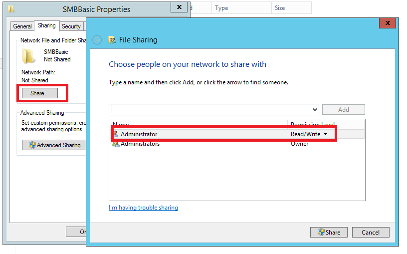

Source Depot Quick Start
========================

What is Source Depot?
=====================

Source Depot is a DOS-based command-line source control program that stores files on a central server location. Members of a team can become a member of (enlist in) a project depot to share the files in the depot. The depot allows you to add, edit, and delete files in the project depot, and keeps track of changes made by everyone enlisted in the project.

When you enlist in a Source Depot project, you create a copy of all or part of the project depot on your local computer, called your client workspace. In this client workspace, you use Source Depot commands to:

-   Keep the copy of the files on your computer up-to-date with the files on the central server (called synchronizing)

<!-- -->

-   Add new files to the depot

<!-- -->

-   Check out existing files, and then check in your changes to the files

<!-- -->

-   Delete files from the depot

Source Depot commands are always entered in a command prompt window at a DOS prompt (C:&gt;) in the form

sd *command* *arguments*

For example:

sd submit sample.rc

In this example, the **sd submit** command submits the changes you've made in sample.rc to the depot.

**Note** All Source Depot commands are in lowercase letters and are case-sensitive. If you use capital letters, Source Depot will return an error message.

Setting up Enlistment
=====================

Check out instructions on **PinpointEnlistments.doc**.

If you have an enlistment already, just ***sd sync*** your enlistment to be sure it is the latest.

Use Basic Source Depot Commands
===============================

Open shortcut for the enlistment on your desktop:

-   Add Files to the Depot
    ======================

Adding files to the depot requires two Source Depot commands. You must first add the files and then submit them to the depot.

To add a file

1.  Copy the files you want to add to the folder in the depot where you want to add the files.

> **Note** If the folder doesn't exist, create it using Windows explorer or the DOS command mkdir. For example,
>
> mkdir *newfolder*

1.  Type **sd add** with the names of the files you want to add. You can add more than one file using wildcards or by separating the file names with spaces

sd add *filename filename*

1.  Type **sd submit** to commit your changes to the depot.

sd submit

1.  In the submit form that appears, replace the description text in the form and enter a note about the files being added.

-   Edit or Check Out Files in the Depot
    ====================================

Before you edit a file in Source Depot, you should run **sd sync**. **sd sync** ensures that you have the most current copy (or head revision) in the depot copied down to your local directory. Checking a file out of the depot by using **sd edit**, is also referred to as "opening" the file.

**To edit (check out) a file**

1.  To edit a particular file, type **sd edit**, and then the file name.

sd edit path\\*filename*

1.  Make the changes to your file.

**To submit (check in) your changes to the depot**

1.  Type **sd submit**:

sd submit

> The Checkin Wizard opens.
>
> 
>
> Chose the file you want to submit, click “Next” and turn to the Checkin details page:
>
> 

1.  In the form, you need to enter the details for the checkin.

<!-- -->

1.  Fill in the submit form and click “Next”. Source Depot checks in the file, and gives you the changelist number for your checkin.

> **Note** You should edit, build, and then regress a file before checking it in.
>
> You can simultaneously check out a batch of files to edit them by using the Source Depot wildcard "\*".
>
> sd edit \\\*.h
>
> sd submit \\\*.h

The wildcards you can use in Source Depot include:

| **Wildcard**   | **Description**                                                                                           |
|----------------|-----------------------------------------------------------------------------------------------------------|
| \*             | All files in the current directory.                                                                       |
| ...            | All files under the current directory and all subdirectories. This wildcard acts as a recursive option.   |

-   Revert Files in the Depot
    =========================

Any file opened for add, edit, or delete can be removed from its changelist with **sd revert**. This command will revert the file in the client workspace back to its unopened state, and any local modifications to the file will be lost.

**To revert files**

1.  Type sd revert plus the name of your file.

> sd revert *filename*

When you revert a file, you will get a report of the filename, the action that was taken on the file, and a statement letting you know the file has been reverted.

-   Submit Files to the Depot
    =========================

You check in, or "submit" files. Submitting files to the depot is accomplished by using the **sd submit** command.

**To submit files**

-   Submit your work to the depot, by typing:

> sd submit *filename*

You can specify a file name if you have checked out a lot of files and only wish to submit a single file. Typing **sd submit** without a filename checks in all of the files you have checked out in the current directory.

**Important**: You should always try to make your file submissions complete and self-contained. This way your team will be able to see all of your changes at once, and can view the changes as a whole. If your submissions are complete, you will be able to back out of your entire change if necessary. Partial submissions, or checking in part of a fix is not recommended.

When saving files to the Source Depot, transactions are either all successfully completed or not. If one of the transactions is not successfully submitted to the depot, you will experience a submission failure.

-   Delete Files from the Depot 
    ============================

Files are deleted from the depot using a similar method to adding or editing files. The **sd delete** command opens the file to delete it from the changelist, and then the **sd submit** command deletes the file from the depot. **sd delete** will also delete the file from the client workspace once the **sd delete** command is given.

**To delete a file**

-   To delete a file in the depot and on the client workspace, type:

> sd delete *filename*
>
> sd submit

**Note** Old file revisions are never actually deleted from the depot. This feature makes it possible to recover any deleted files back into the client workspace.

-   Get Help on Source Depot Commands
    =================================

Use the **sd help** \[*command*\] to access information on any Source Depot command.

To display help for a command

-   At the command prompt, type **sd help**, followed by the name of the command you want help on. For example:

sd help add

In this example, you will receive a list of helpful information along with any flag option information on the command **sd add**.

For a list of the basic SD help commands, you can type **sd help simple**, or to get a complete list of the SD help commands, type **sd help commands**.

Use the Pipe character | plus the word **more** after any **sd help** \[command\] statement to control the scroll speed of help, so that you can view one screen at a time.

sd help \[*command*\] |more

Use SDB to perform operations in UI
===================================

-   What is SDB?
    ============

SDB is unofficial GUI client for Source Depot. enabling easy access to most day-to-day source control activities.

-   Setting up SDB
    ==============

You can download or install SDB from: [\\\\v-misu02\\Shares\\Softwares Setup\\sdb setup.msi](file:///\\v-misu02\Shares\Softwares%20Setup\sdb%20setup.msi)

-   SDB instruction
    ===============

Open shortcut for the enlistment on your desktop then input sdb in the command line:

And then you will start SDB application:

**File menu**

-   **Open Depot**  open a new depot

-   **Recent Depot**  open recent depot

-   **Add Files**  add files to depot. Note that depot location is determined by SD client mapping, and does not depend on selected folder

-   **Add Dir** add a folder and subfolder to depot. Note that depot location is determined by SD client mapping, and does not depend on selected folder

-   **Rename**  rename a file

-   **Delete**  delete a file or directory

**Edit menu**

-   **Copy** copy depot path of selected file to clipboard

**View menu**

-   **Refresh ** refresh the tree

<!-- -->

-   **Pending changelists**   switch right panel to view pending change lists opened in current client

-   **Submitted changelists**  switch right panel to view all submitted pending change lists

-   **Branch specs**  switch right panel to view bracnhes

-   **Client specs**  switch right panel to view clients

<!-- -->

-   Add files
    =========

Click “add file(s) to deport…” button to add files.

-   Edit files
    ==========

Check out your files first, don’t forget to check out the files such as “.sln”, “.csproj”,etc when you add or remove projects or files.

Right click the file you want to edit, then click Sync & Check out” item in the menu, the file will be writable, then you can open it in your editor, don’t forget to save your file after you finished.

**Note:** Before you edit your file, you should “Get Latest Version” first to ensure you edit the file is an updated one.

-   Creating a pack
    ===============

Open your sd browser with ‘sdb’, refresh the right-side ‘pending changelists’, pick one change list, you will see the files which are new or updated being listed.

Make sure your change are listed in the table, and go to command line, run “sdp pack 100204\_v-xxx\_TestPack –c &lt;Num&gt;”. The dpk file will locate in the folder you are running the command, and the name will be 100204\_v-xxx\_TestPack.dpk, “-c &lt;Num&gt;” identifies the change list number you are packing.

Some other useful sdp command:

sdp diff 100204\_v-xxx\_TestPack.dpk : see the difference with older files in the source deport.

sdp diff2 100204\_v-xxx\_TestPack.dpk 100205\_v-xxx\_TestPack : see the difference between the the two files.

sdp apply 100204\_v-xxx\_TestPack.dpk : To get the latest change from the package even if the code is not checked in yet.
